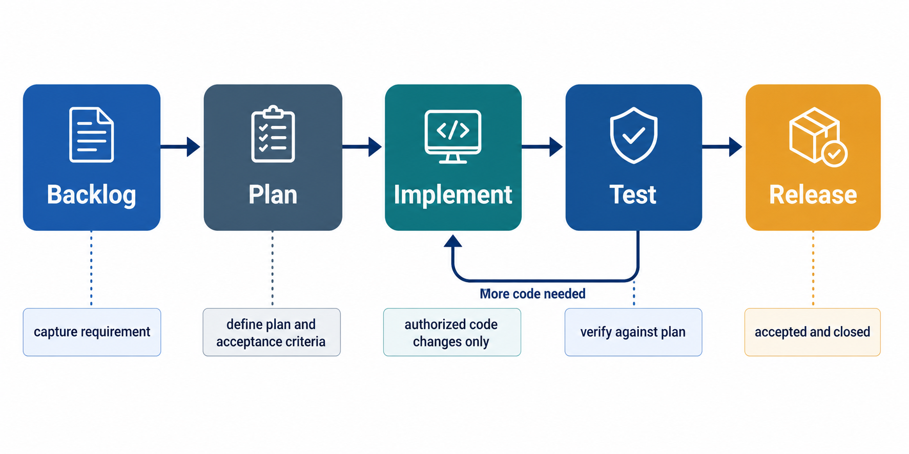
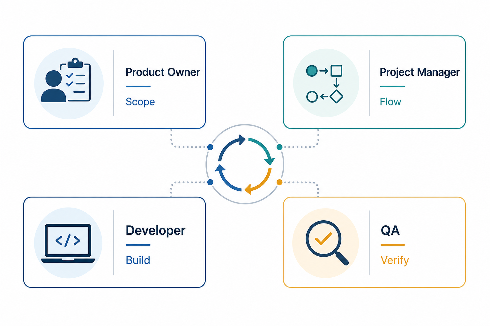
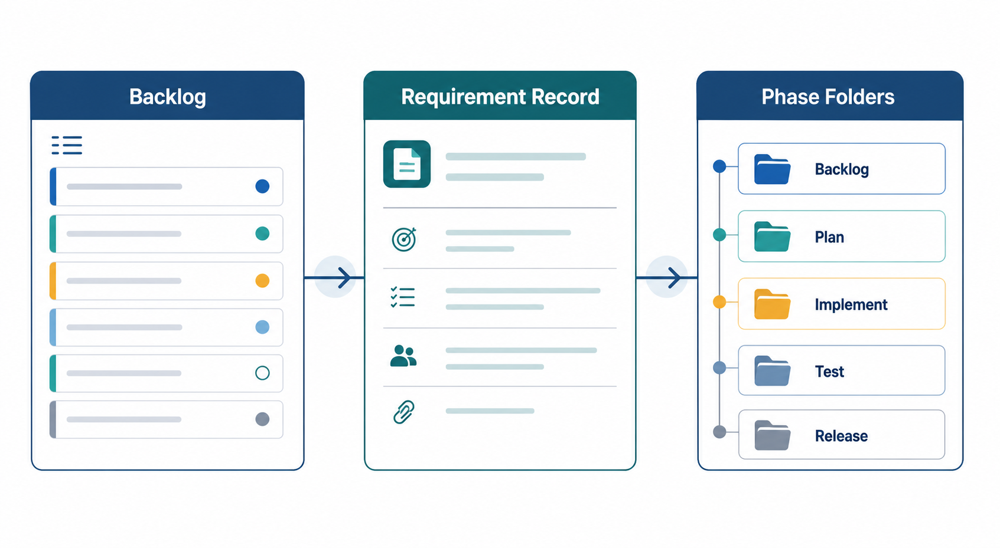
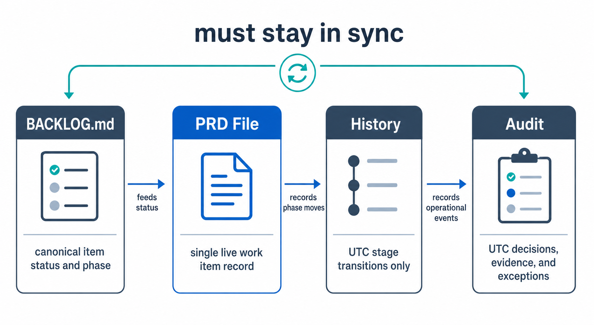
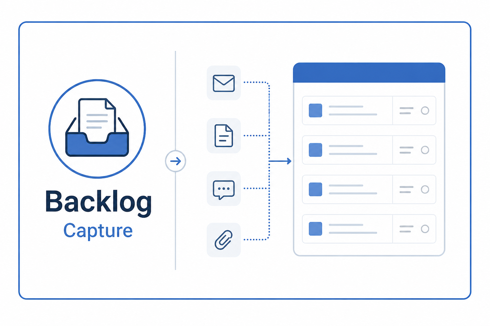
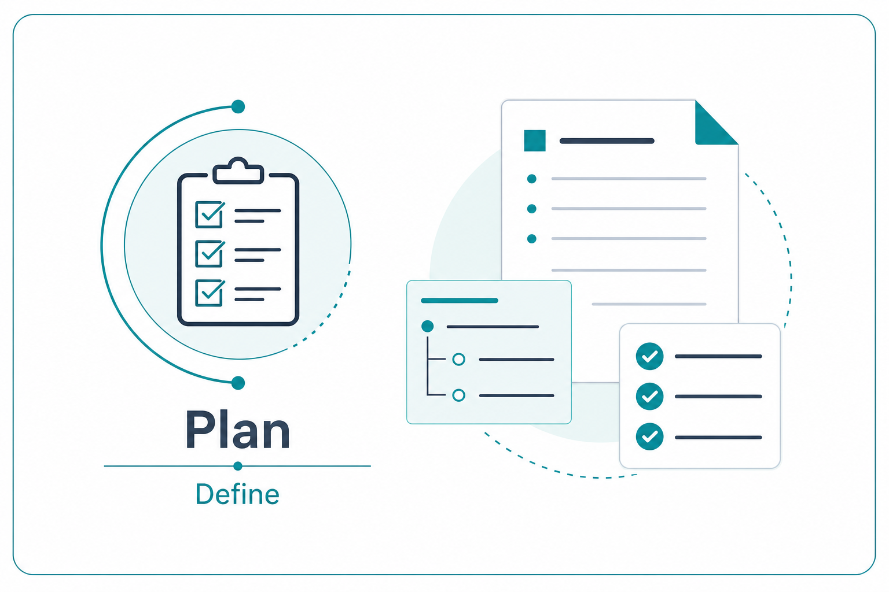
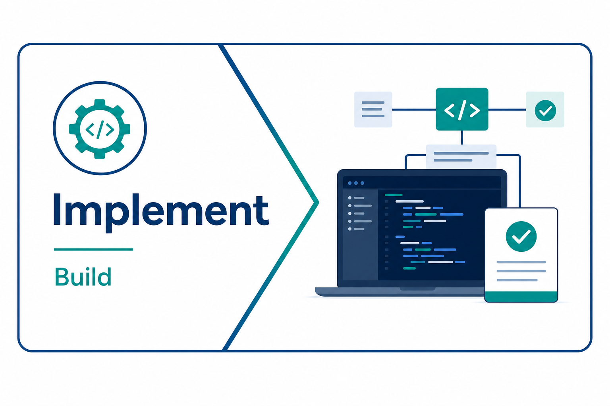
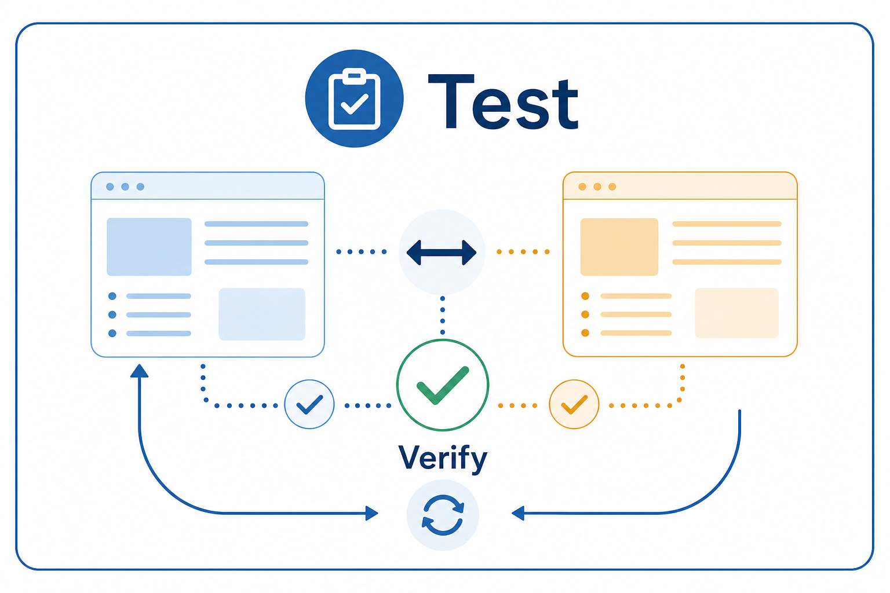
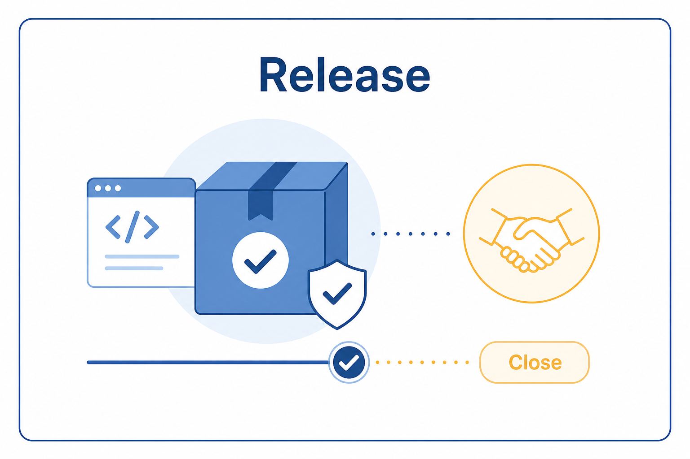
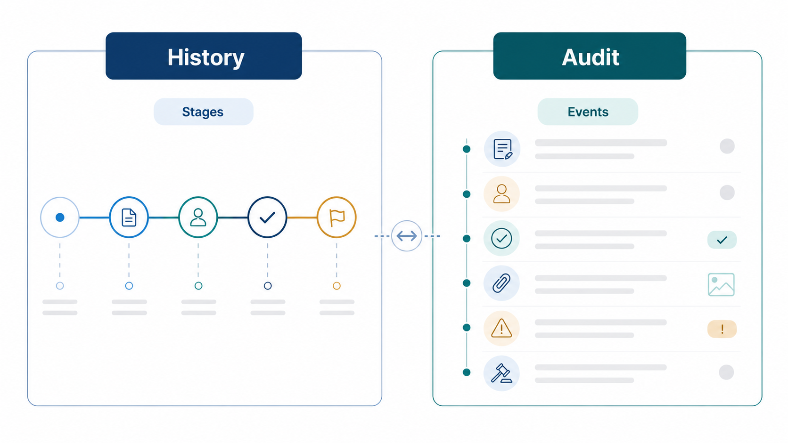

# Workflow Guide

> Derived, human-facing documentation. This guide is not normative and is not part of default agent context. For current rules, follow `WORKFLOW.md`, `BACKLOG.md`, and the relevant local skill.

## Status

Draft in progress. This document is being built incrementally from the live workflow rules in `WORKFLOW.md`, `BACKLOG.md`, and `.agents/local-agent.md`.

## Audience

This guide is for software development contributors across product ownership, project management, development, and QA.

## Source Of Truth

- `WORKFLOW.md`
- `BACKLOG.md`
- `.agents/local-agent.md`

## Workflow Overview

This workflow gives each work item one backlog entry, one requirement record, and one visible lifecycle state. Work only becomes real when it is captured in both the backlog and the requirement record, then moved through the same fixed sequence:

`Backlog -> Plan -> Implement -> Test -> Release`

The goal is to keep the process lightweight while preventing the most common delivery failures: vague requests, hidden scope growth, informal status changes, weak verification, and reconstructed audit history. The same requirement record moves through every stage and is never replaced with a later-phase copy.

This visual shows the normal left-to-right path through the workflow. The most important exception is the return path from `Test` back to `Implement`, which is required whenever testing reveals more code work.

## Roles And Responsibilities

This visual shows the four main human roles around the workflow with only the lightest responsibility cues: Product Owner shapes scope, Project Manager maintains flow, Developer builds, and QA verifies.

### Product Owners

Product owners are responsible for making sure new work starts as a real requirement rather than an informal idea. They should focus on whether the problem is worth solving, whether the goal is clear, and whether the scope is appropriately bounded.

Typical responsibilities:

- sponsor or request a new backlog item
- help shape the initial requirement
- confirm the intended outcome
- clarify what is in scope and out of scope
- support the decision to move from `Backlog` to `Plan`

### Project Managers

Project managers use the workflow as the operational control surface. Their main concern is whether the recorded state of work matches reality.

Typical responsibilities:

- monitor the live backlog as the status view
- confirm that phase transitions are explicit
- watch for blocked or drifting items
- verify that backlog state and requirement record stay aligned
- help keep the team honest about where work really sits

### Developers

Developers use the workflow as the gate for authorized implementation. Their key concern is whether planning is good enough to support safe code changes.

Typical responsibilities:

- refuse code work unless the PRD is in `Implement`
- use the PRD as the working source for scope, plan, and verification
- record meaningful decisions and discoveries in `Audit`
- avoid silent scope growth
- create a new backlog item if a materially new requirement emerges

### QA

QA uses the workflow to make verification explicit. Their concern is whether the item was truly tested against its stated intent before being treated as done.

Typical responsibilities:

- use the `Verification` section as the test anchor
- record important evidence and outcomes
- send items back to `Implement` when more code changes are required
- help determine whether an item is genuinely ready for `Release`

## Core Workflow Objects

### `BACKLOG.md`

`BACKLOG.md` is the canonical source of truth for PRD items, their overall status, and their current workflow phase.

It tells the team:

- which items exist
- which items are backlogged
- which items are in progress
- which items are done
- the current status and phase for each item

If the backlog disagrees with the requirement's current stage location, the backlog wins and the requirement should be moved to match it.

### The Requirement Record

The requirement record is the detailed record for one work item. It explains what the item is, why it exists, how it should be approached, how it will be verified, and what happened during the workflow.

Each PRD uses the naming format:

`PRD-NNNNNN-{CLASS}`

Examples of `{CLASS}` include:

- `BUG`
- `CHANGE`
- `TECH`
- `UI`

### The Phase Folders

The phase folders are not copies or archives. They represent the current position of the live requirement record.

- the backlog folder means the item has been captured but not yet actively planned for implementation
- the plan folder means the item is being prepared into an implementation-ready package
- the implement folder means code work is currently authorized and under way
- the test folder means implementation is complete enough to verify
- the release folder means the item has been accepted and closed out

This visual shows the four workflow surfaces that must remain aligned. The backlog expresses the official state, the requirement record holds the detailed working record, `History` captures phase movement, and `Audit` captures the supporting operational trail.

## Lifecycle Walkthrough

### 00 - Backlog

This is the capture phase. Work becomes real here.

To enter `Backlog`, the item must have:

- a backlog entry
- a matching requirement record in the backlog folder

The creation of the requirement record counts as the transition into `Backlog` and must be recorded in the `History` table.

What this phase is for:

- capturing a real requirement
- assigning a durable ID
- giving the team something trackable and discussable

What this phase is not for:

- coding
- implicit planning by chat alone
- vague idea parking without a PRD record

### 01 - Plan

This is the preparation phase. The purpose is to turn a backlog item into a buildable, verifiable work package.

When an item enters `Plan`:

- the requirement moves into the plan folder
- the corresponding backlog entry is updated
- a `Plan` row is added to `History`

This phase should answer:

- what exactly is being changed
- what is deliberately not being changed
- how the work should be carried out
- how success will be tested

The workflow explicitly blocks promotion into `Implement` unless the PRD includes:

- `Plan`
- `Acceptance Criteria`
- `Verification`
- `Next Step`

### 02 - Implement

This is the execution phase. It is the only phase in which code changes are authorized.

When an item enters `Implement`:

- the requirement moves into the implement folder
- the backlog entry moves to `In Progress`
- an `Implement` row is added to `History`

Developers should treat the requirement record as the approved work boundary. The workflow allows normal implementation learning, but it does not allow silent scope expansion.

If additional work is discovered:

- keep it in the current requirement only if it remains within scope
- create a separate backlog item if the discovery materially changes the original ask

### 03 - Test

This is the verification phase.

When an item enters `Test`:

- the requirement moves into the test folder
- the backlog entry remains `In Progress`
- a `Test` row is added to `History`

This phase exists to prove that implementation actually meets the planned intent.

If testing uncovers more implementation work:

- move the requirement back to `Implement`
- update the backlog entry
- record the return transition in `History`
- only then resume code changes

The workflow deliberately separates testing from coding so that quality gates remain visible.

### 04 - Release

This is the closeout phase.

When an item enters `Release`:

- the requirement moves into the release folder
- the backlog entry moves to `Done`
- a `Release` row is added to `History`

At this point the item is treated as shipped, accepted, or otherwise complete enough to close.

The released requirement record remains the durable final record for that item.

## PRD Structure

Every requirement record must include the following mandatory sections in this exact order:

1. `Short Name`
2. `Goal`
3. `Context`
4. `Scope`
5. `Plan`
6. `Acceptance Criteria`
7. `Verification`
8. `Next Step`
9. `History`
10. `Audit`

If any required section is missing, the requirement record is invalid. It must not be promoted and it must not be used to authorize code changes.

## History And Audit

This workflow separates lifecycle movement from supporting evidence. `History` records only stage transitions, while `Audit` records other timestamped events such as decisions, evidence, approvals, risks, clarifications, exceptions, and backfill notes.

All workflow timestamps must be recorded in UTC using `yyyy-MM-ddTHH:mm:ss.fffffffZ`, and both `History` and `Audit` should be updated when the event happens. `History` must remain chronologically true, so if a transition was missed it should not be reconstructed there later; instead, explain the gap in `Audit`, and use `Legacy Notes` when older non-standard carryover also needs to be preserved.

## Operating Authority

This guide explains the workflow visually, but it does not own the operating rules. Follow `WORKFLOW.md` for lifecycle invariants, `BACKLOG.md` for current item state, and the relevant local skill for each operation.

## Where To Operate

Use the local skill that owns the operation:

- [grill-me](../.codex/skills/grill-me/SKILL.md) for requirement shaping
- [prd-backlog](../.codex/skills/prd-backlog/SKILL.md) for backlog creation and templates
- [prd-promote](../.codex/skills/prd-promote/SKILL.md) for phase validation and paired moves
- [prd-implement](../.codex/skills/prd-implement/SKILL.md) for implementation readiness and scoped code work
- [prd-patch](../.codex/skills/prd-patch/SKILL.md) for product test-candidate preparation

`WORKFLOW.md` defines the lifecycle contract. `BACKLOG.md` defines current item state. The skills define the procedures and templates. This guide explains the ideas and visual model only; it does not restate their operating rules.

## How A New Item Starts

For the current creation procedure, use [prd-backlog](../.codex/skills/prd-backlog/SKILL.md) and its templates. This guide keeps only the conceptual lifecycle explanation above.

## Handling Exceptions

Use [prd-promote](../.codex/skills/prd-promote/SKILL.md), [prd-implement](../.codex/skills/prd-implement/SKILL.md), and `WORKFLOW.md` for exception handling. This guide does not duplicate their blocker or return-to-phase procedures.

The guide's role is explanatory: show the lifecycle and visual model without becoming another operating source.

## Notes On Usage

Keep this guide in `.scratch` as derived human documentation. Do not load it as default agent context or use it as a source of truth.