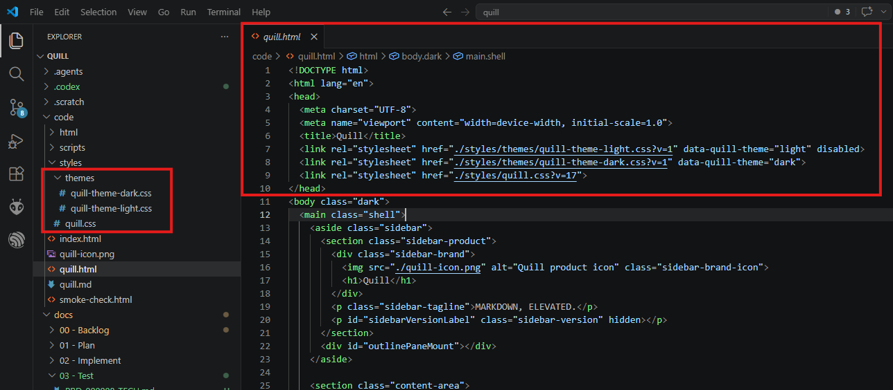
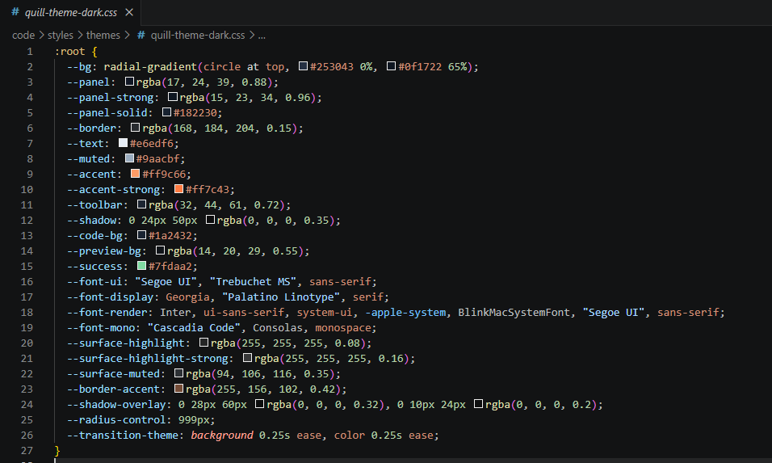
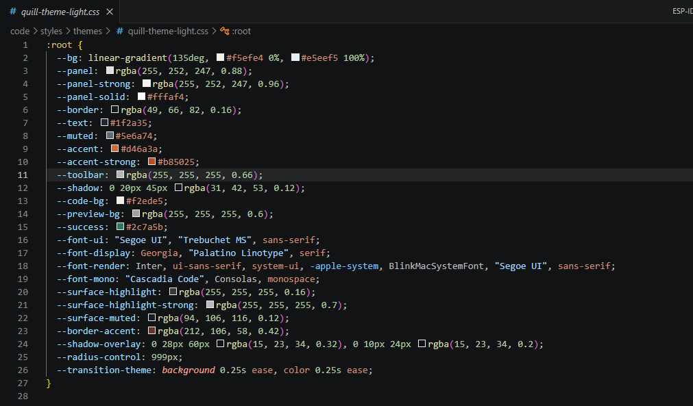

# TC-01 Evidence

| Field | Detail |
| --- | --- |
| PRD | [PRD-000008-TECH](../25%20-%20Closed/PRD-000008-TECH.md) |
| Acceptance Criteria | AC-01 |
| Product Version | 1.0.6 |
| Git Commit | 07a997edf3a9f250ecd8159e50084bc9bfa36b3d |
| Status | complete |
| Recorded | 2026-08-05T23:54:30.6678285Z |
| Test | Inspect the stylesheet loading boundary and repository structure for the named light and dark theme stylesheets. |
| Result | Pass |

## Evidence

**Figure 1 — Named theme stylesheets and loading links**



Observation: The repository tree shows `quill-theme-light.css` and `quill-theme-dark.css` under `code/styles/themes`. The `quill.html` head shows both named theme stylesheets and `quill.css` loaded, with the light stylesheet disabled and the dark stylesheet active.

**Figure 2 — Dark theme contract definitions**



Observation: The dark theme defines the shared custom-property names for colors, surfaces, fonts, shadows, rendering styles, control radius, and theme transitions.

**Figure 3 — Light theme contract definitions**



Observation: The light theme defines the same custom-property names as the dark theme, with light-theme values.

## Static Inspection

### 1. Theme declarations

Checks that `quill.css` contains no theme-token declarations or legacy theme blocks.

```powershell
$declarations = Select-String -Path code\styles\quill.css -Pattern '^\s*--[A-Za-z0-9_-]+\s*:'
$themeBlocks = Select-String -Path code\styles\quill.css -Pattern '^\s*:root|body\.dark'
if ($declarations) {
  "FAIL: quill.css still declares theme variables"
  $declarations | ForEach-Object { $_.Line.Trim() }
} else {
  "PASS: quill.css has no custom-property declarations"
}
if ($themeBlocks) {
  "FAIL: quill.css still contains theme blocks"
  $themeBlocks | ForEach-Object { $_.Line.Trim() }
} else {
  "PASS: quill.css has no :root or body.dark theme blocks"
}
```

Result:

```text
PASS: quill.css has no custom-property declarations
PASS: quill.css has no :root or body.dark theme blocks
```

### 2. Variable consumption

Lists the shared theme variables consumed by `quill.css`.

```powershell
$css = Get-Content -Raw code\styles\quill.css
$matches = [regex]::Matches($css, 'var\(--([A-Za-z0-9_-]+)')
$consumed = @($matches | ForEach-Object { $_.Groups[1].Value } | Sort-Object -Unique)
"Variables consumed by quill.css:"
$consumed
```

Result:

```text
Variables consumed by quill.css:
accent
accent-strong
bg
border
code-bg
danger
font-display
font-mono
font-render
font-ui
muted
panel
panel-solid
panel-strong
preview-bg
radius-control
shadow
shadow-overlay
success
surface-highlight
surface-highlight-strong
surface-muted
text
transition-theme
```

`danger` is used only through a CSS fallback expression and is not a required theme token for this item.

### 3. Contract parity

Compares the variable names exposed by the light and dark theme files.

```powershell
function Get-ThemeVariables($path) {
  $matches = Select-String -Path $path -Pattern '^\s*--([A-Za-z0-9_-]+)\s*:'
  @($matches | ForEach-Object {
    $_.Matches.Groups[1].Value
  } | Sort-Object -Unique)
}
$light = Get-ThemeVariables 'code\styles\themes\quill-theme-light.css'
$dark = Get-ThemeVariables 'code\styles\themes\quill-theme-dark.css'
$differences = Compare-Object $light $dark
if ($differences) {
  "FAIL: light and dark theme contracts differ"
  $differences
} else {
  "PASS: light and dark themes expose the same variable names"
}
```

Result:

```text
PASS: light and dark themes expose the same variable names
```
