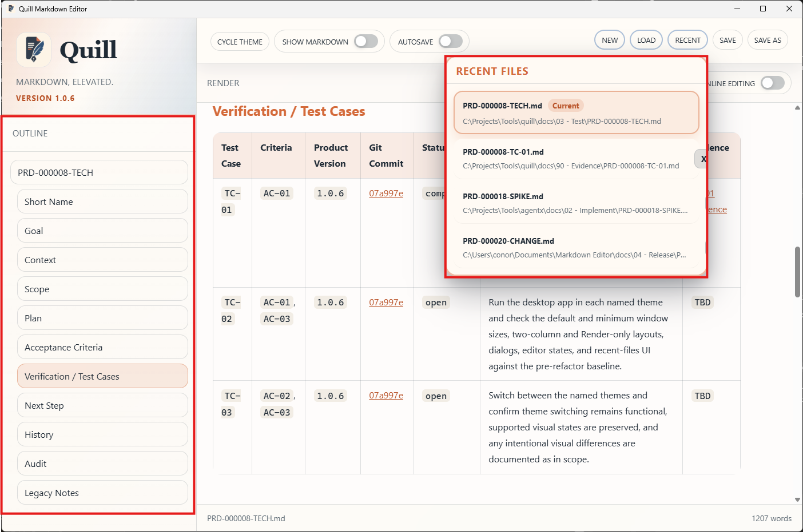
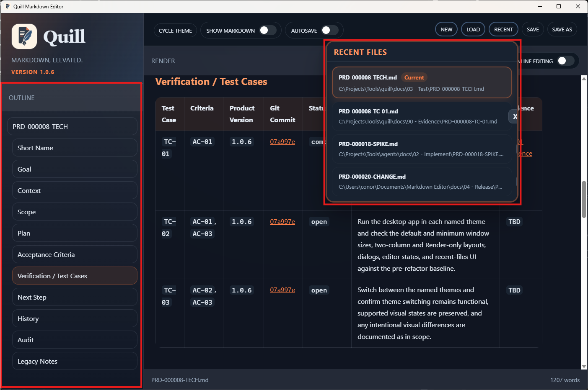
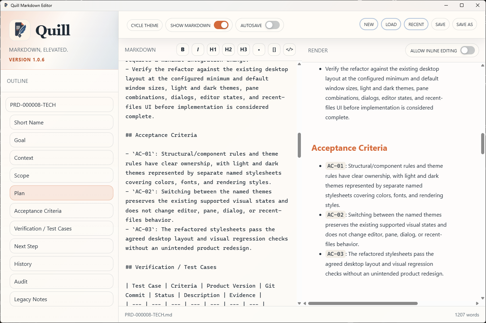
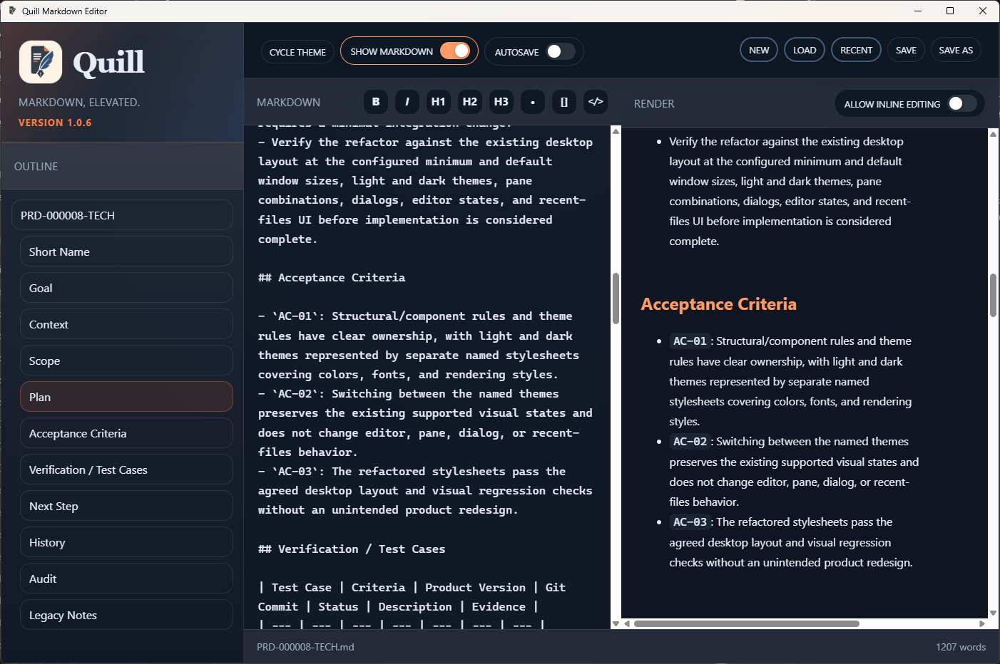
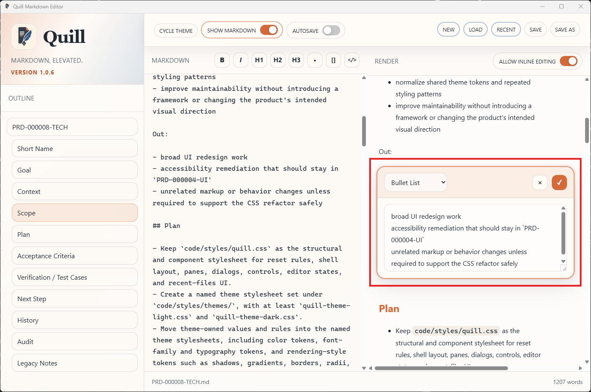
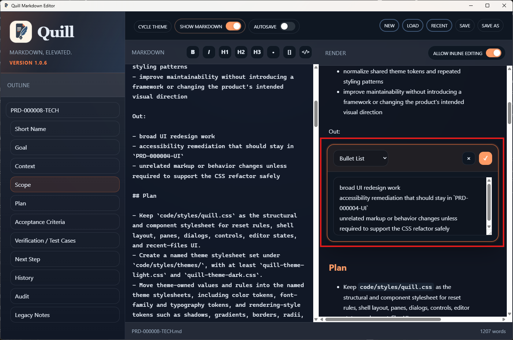

# TC-02 Evidence

| Field | Detail |
| --- | --- |
| PRD | [PRD-000008-TECH](../25%20-%20Closed/PRD-000008-TECH.md) |
| Acceptance Criteria | AC-01, AC-03 |
| Product Version | 1.0.6 |
| Git Commit | 07a997edf3a9f250ecd8159e50084bc9bfa36b3d |
| Status | complete |
| Recorded | 2026-08-06T00:14:05.9469118Z |
| Test | Run Quill in light and dark themes at a representative desktop window size, then inspect the two-column Markdown and Render state, Render-only state, Recent Files UI, and inline Markdown editing state. |
| Result | Pass. The combined screenshots show Quill version 1.0.6 in both light and dark visual states, with Show Markdown disabled for Render-only mode, Show Markdown enabled for the two-column Markdown and Render mode, Recent Files visible in Render-only mode, and the Markdown formatting toolbar plus inline editing enabled in the editor state. Dialog checks are outside this item’s theme-controlled surfaces, and multiple window sizes are not required by the refined test scope. `TC-02` is complete. |

## Evidence

**Figure 1 - Light theme Render-only mode with Recent Files**

Observation: The light theme is active, Show Markdown is disabled, the Render pane occupies the main content area, and the Recent Files panel is visible with `PRD-000008-TECH.md` marked Current.

**Figure 2 - Dark theme Render-only mode with Recent Files**

Observation: The dark theme is active, Show Markdown is disabled, the Render pane occupies the main content area, and the Recent Files panel is visible with `PRD-000008-TECH.md` marked Current.

**Figure 3 - Light theme Markdown and Render display**

Observation: The light theme shows the Markdown and Render panes together. The Markdown pane displays the source content and the Render pane displays the corresponding formatted Markdown, including the Acceptance Criteria list.

**Figure 4 - Dark theme Markdown and Render display**

Observation: The dark theme shows the Markdown and Render panes together. The Markdown pane displays the source content and the Render pane displays the corresponding formatted Markdown, including the Acceptance Criteria list.

**Figure 5 - Light theme inline Markdown editing state**

Observation: The light theme shows the Markdown pane, formatting toolbar, and `ALLOW INLINE EDITING` enabled while the Render pane displays the corresponding content.

**Figure 6 - Dark theme inline Markdown editing state**

Observation: The dark theme shows the Markdown pane, formatting toolbar, and `ALLOW INLINE EDITING` enabled while the Render pane displays the corresponding content.
