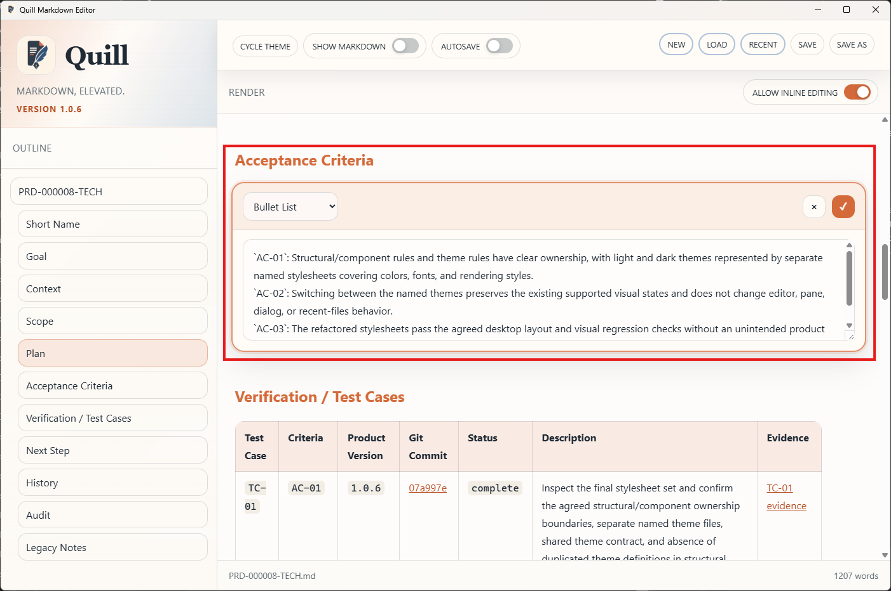
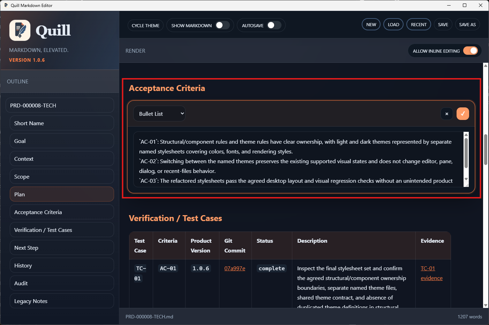

# TC-03 Evidence

| Field | Detail |
| --- | --- |
| PRD | [PRD-000008-TECH](../04%20-%20Release/PRD-000008-TECH.md) |
| Acceptance Criteria | AC-02, AC-03 |
| Product Version | 1.0.6 |
| Git Commit | 07a997edf3a9f250ecd8159e50084bc9bfa36b3d |
| Status | complete |
| Recorded | 2026-08-06T00:19:29.7575566Z |
| Test | Switch between the named light and dark themes and inspect the preserved Render-only layout and supported visual states. |
| Result | Pass. The screenshots show the same Render-only layout, Acceptance Criteria content, Test Cases table, and inline editing control in both themes, with intentional light/dark color differences. `TC-03` is complete. |

## Evidence

**Figure 1 - Light theme after theme switch**

Observation: The light theme is active and preserves the Render-only layout, Acceptance Criteria content, Test Cases table, and enabled `ALLOW INLINE EDITING` control.

**Figure 2 - Dark theme after theme switch**

Observation: The dark theme is active and preserves the same supported layout and content while applying the intended dark theme colors and rendering styles.
