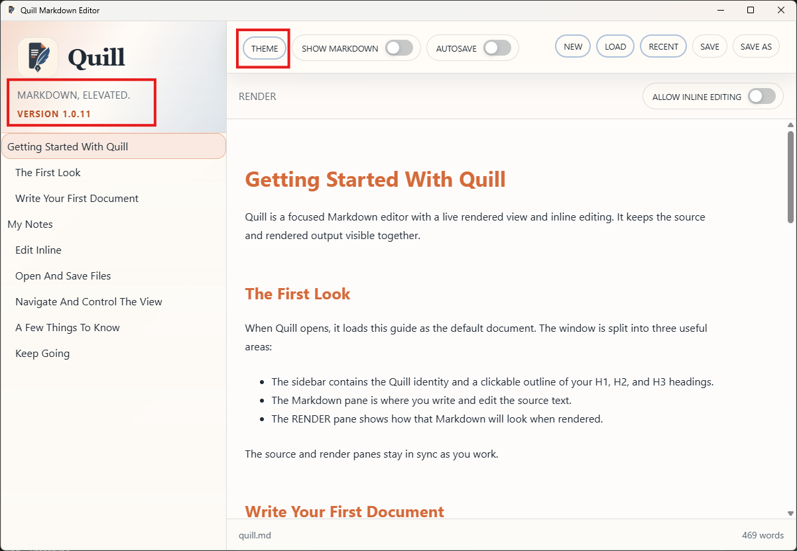
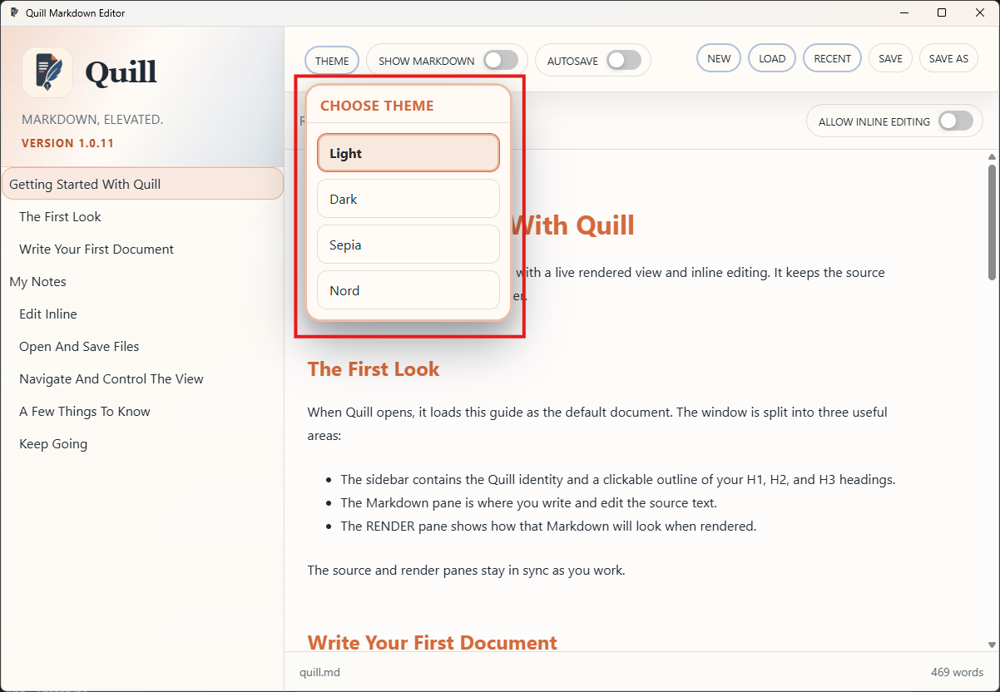

# TC-01 Evidence

| Field | Detail |
| --- | --- |
| PRD | [PRD-000009-UI](../../docs/20%20-%20Test/PRD-000009-UI.md) |
| Acceptance Criteria | AC-01 |
| Product Version | 1.0.11 |
| Git Commit | 7d5324430dcacb5cf871440cf8274995e2726ee0 |
| Status | complete |
| Recorded | 2026-08-08T09:45:37.6391428Z |
| Test | Launch Quill, confirm the cycle-only control has been replaced by a clearly labelled theme dropdown, open the control, and confirm that theme choices are available by name. |
| Result | PASS — The final screenshot shows Quill version 1.0.11, the clearly labelled `THEME` control, the opened theme chooser, and the named choices Light, Dark, Sepia, and Nord. AC-01 passed. |

## Steps to Reproduce

1. Launch the packaged Quill application.
2. Confirm the window displays version 1.0.11.
3. Locate the `THEME` control in the top toolbar.
4. Open the `THEME` control.
5. Confirm that the supported theme choices are listed by name.

## Evidence

### Initial control state

### Final opened chooser

