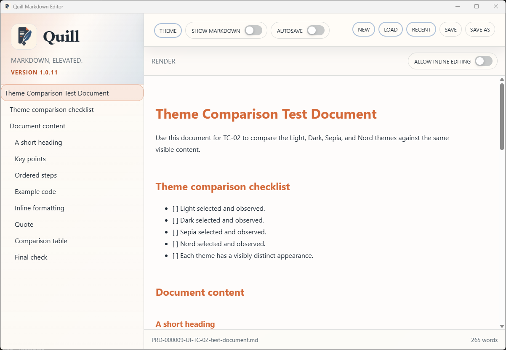
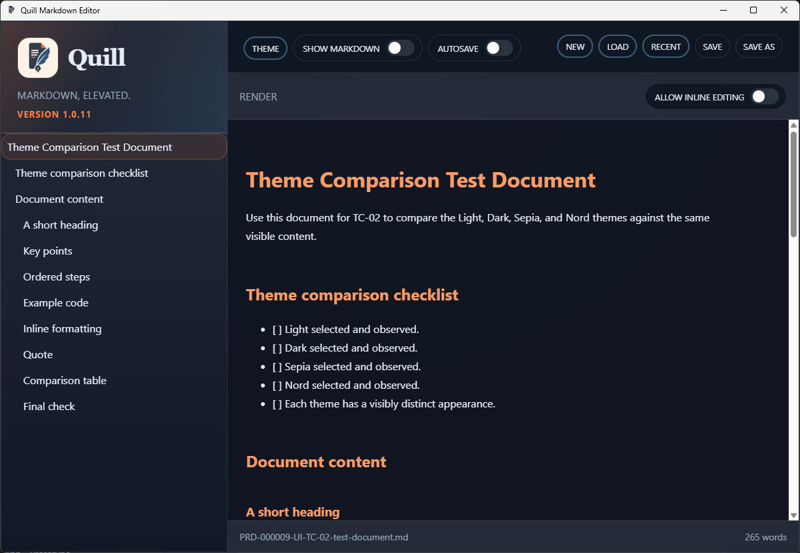
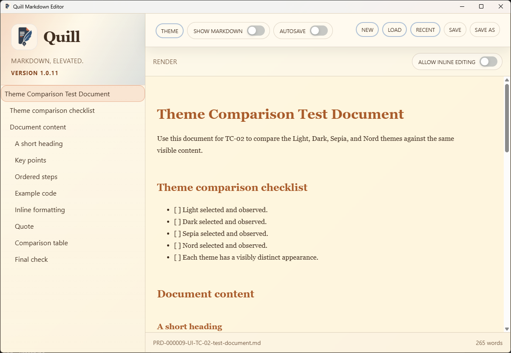
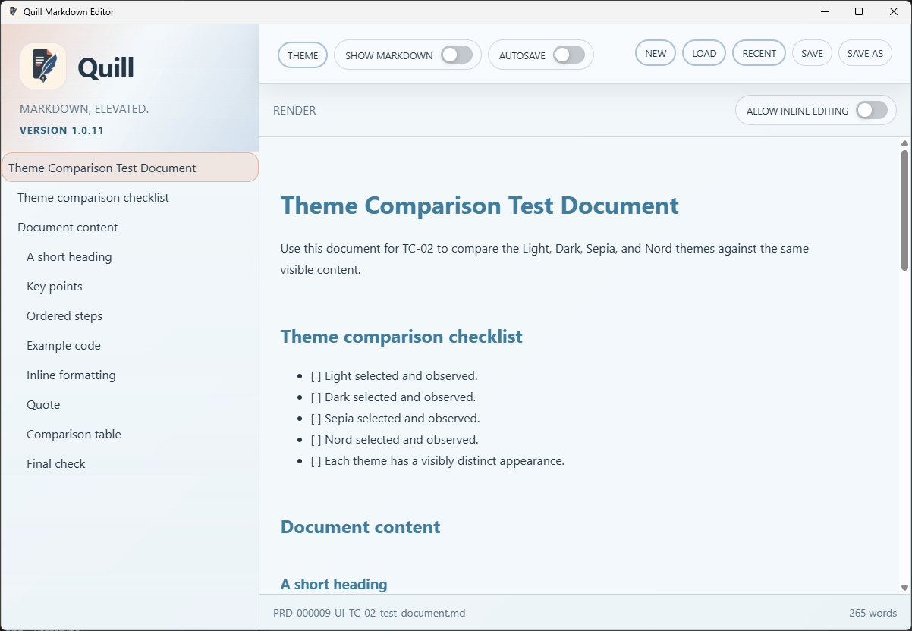

# TC-02 Evidence

| Field | Detail |
| --- | --- |
| PRD | [PRD-000009-UI](../../docs/20%20-%20Test/PRD-000009-UI.md) |
| Acceptance Criteria | AC-02, AC-06 |
| Product Version | 1.0.11 |
| Git Commit | [7d53244](https://github.com/conorheaney/quill/commit/7d5324430dcacb5cf871440cf8274995e2726ee0) |
| Status | complete |
| Recorded | 2026-08-08T10:21:47.1019065Z |
| Test | Confirm that the theme chooser presents exactly Light, Dark, Sepia, and Nord, and that each choice produces a visibly distinct application appearance. |
| Result | Passed. The chooser presented exactly Light, Dark, Sepia, and Nord, and the supplied screenshots show visibly distinct application appearances for all four selections. |

## Preconditions

- Use the committed packaged Quill `1.0.11` candidate identified above.
- Start with Quill open to a document that contains enough visible content to compare the application appearance, such as headings, body text, a list, and a code block.
- Keep the same document and window size throughout the test.

## Steps to Reproduce

1. Launch Quill and wait for the document and preview to finish loading.
2. Open the `THEME` chooser in the application toolbar.
3. Confirm that the chooser contains exactly these four named choices: `Light`, `Dark`, `Sepia`, and `Nord`.
4. Select `Light` and observe the application background, panels, text, controls, and document preview.
5. Reopen the chooser, select `Dark`, and observe the same areas.
6. Reopen the chooser, select `Sepia`, and observe the same areas.
7. Reopen the chooser, select `Nord`, and observe the same areas.
8. Compare the four observations and confirm that each selection is visibly distinct from the others.

## Expected Results

- The chooser contains exactly four options: Light, Dark, Sepia, and Nord.
- Each option can be selected successfully.
- The selected theme is applied to the visible application immediately.
- Light, Dark, Sepia, and Nord each have a visibly distinct appearance across the application surfaces and document preview.
- The document content and layout remain available while the themes are compared.

## Evidence

The four supplied screenshots show the same test document and Quill `1.0.11` application state for each theme:

### Light

### Dark

### Sepia

### Nord

