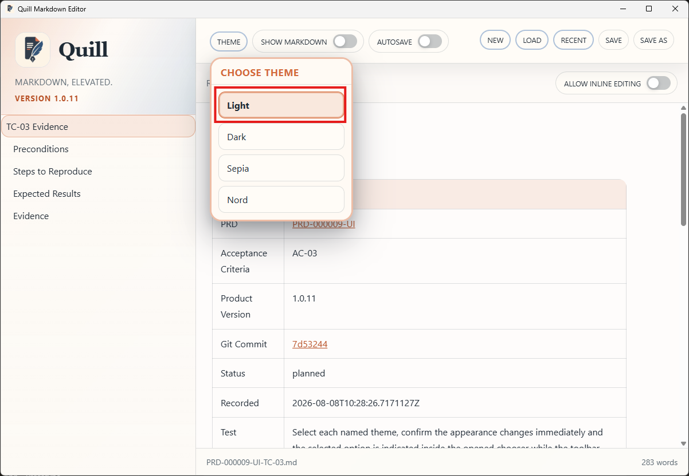
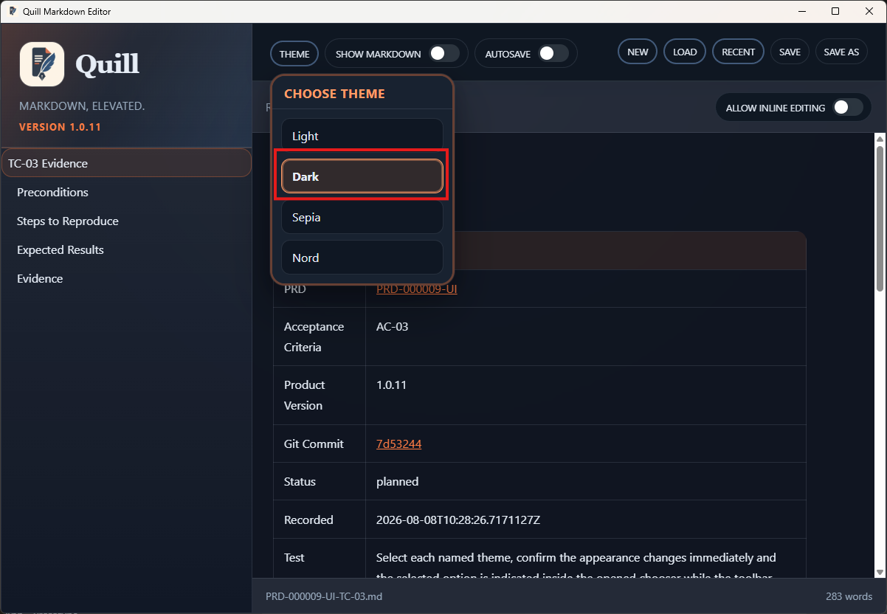
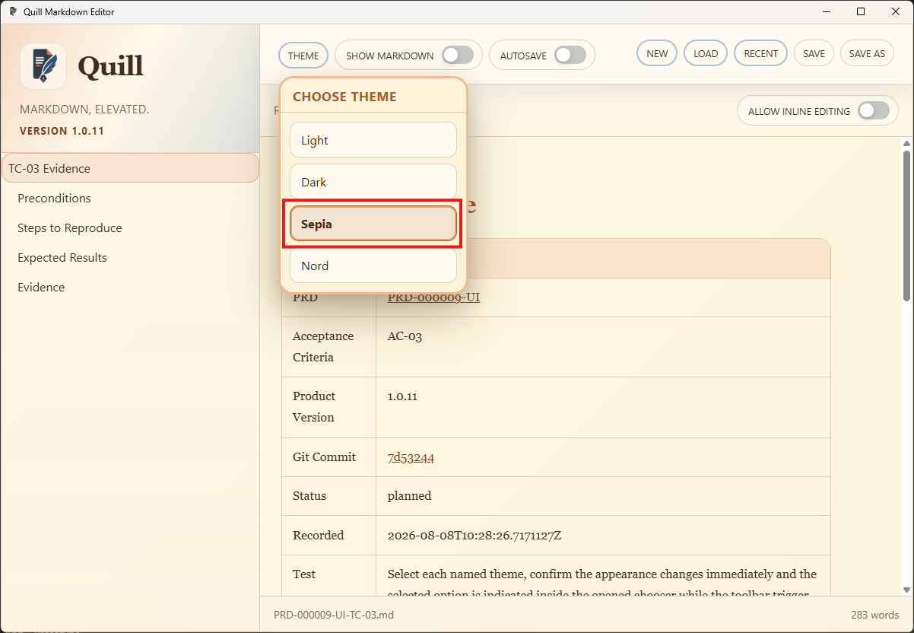
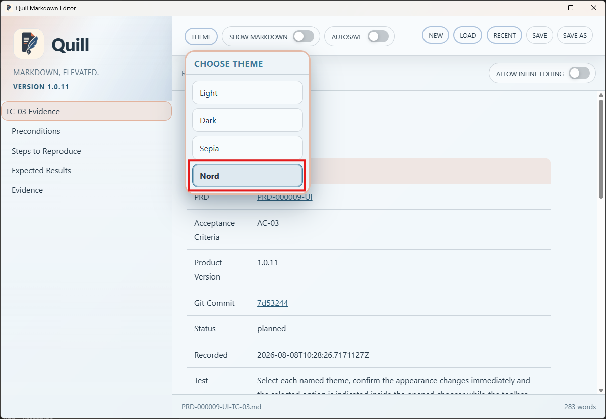
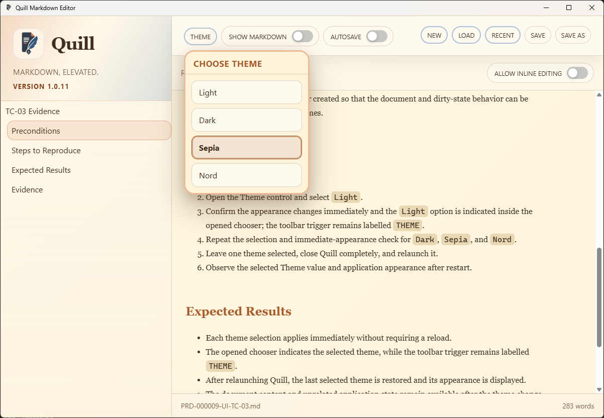
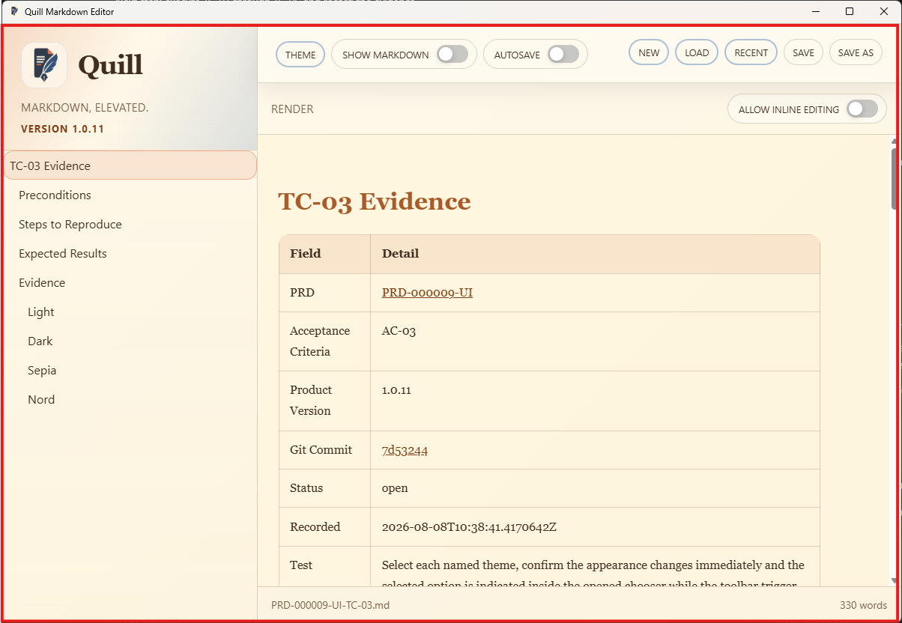

# TC-03 Evidence

| Field | Detail |
| --- | --- |
| PRD | [PRD-000009-UI](../../docs/20%20-%20Test/PRD-000009-UI.md) |
| Acceptance Criteria | AC-03 |
| Product Version | 1.0.11 |
| Git Commit | [7d53244](https://github.com/conorheaney/quill/commit/7d5324430dcacb5cf871440cf8274995e2726ee0) |
| Status | complete |
| Recorded | 2026-08-08T10:41:35.7219564Z |
| Test | Select each named theme, confirm the appearance changes immediately and the selected option is indicated inside the opened chooser while the toolbar trigger remains `THEME`, close and reopen Quill, and confirm the last selected theme is restored. |
| Result | Pass. The supplied screenshots show Light, Dark, Sepia, and Nord applied immediately with the selected option indicated inside the opened chooser while the toolbar trigger remains `THEME`. Additional screenshots show Sepia selected before relaunch and retained after Quill reopened. TC-03 is complete for AC-03. |

## Preconditions

- Quill product version `1.0.11` is installed or launched from the committed candidate.
- The application opens successfully and the Theme control is visible.
- A document can be opened or created so that the document and dirty-state behavior can be observed while changing themes.

## Steps to Reproduce

1. Launch Quill.
2. Open the Theme control and select `Light`.
3. Confirm the appearance changes immediately and the `Light` option is indicated inside the opened chooser; the toolbar trigger remains labelled `THEME`.
4. Repeat the selection and immediate-appearance check for `Dark`, `Sepia`, and `Nord`.
5. Leave one theme selected, close Quill completely, and relaunch it.
6. Observe the selected Theme value and application appearance after restart.

## Expected Results

- Each theme selection applies immediately without requiring a reload.
- The opened chooser indicates the selected theme, while the toolbar trigger remains labelled `THEME`.
- After relaunching Quill, the last selected theme is restored and its appearance is displayed.
- The document content and unrelated application state remain available after the theme change and restart.

## Evidence

### Light

### Dark

### Sepia

### Nord

### Sepia selected before relaunch

### Sepia retained after relaunch

