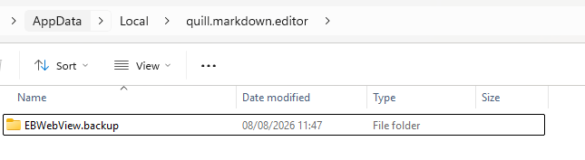
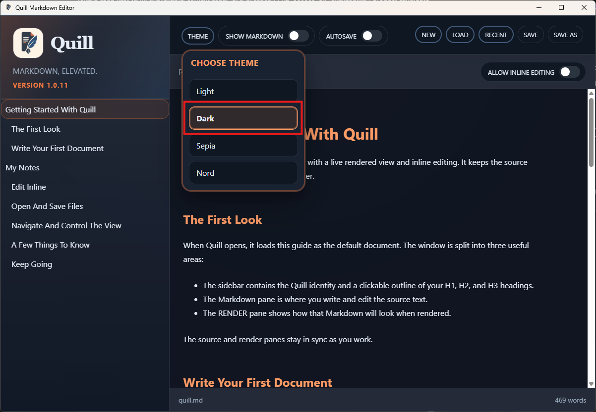

# TC-04 Evidence

| Field | Detail |
| --- | --- |
| PRD | [PRD-000009-UI](../../docs/20%20-%20Test/PRD-000009-UI.md) |
| Acceptance Criteria | AC-04 |
| Product Version | 1.0.11 |
| Git Commit | [7d53244](https://github.com/conorheaney/quill/commit/7d5324430dcacb5cf871440cf8274995e2726ee0) |
| Status | complete |
| Recorded | 2026-08-08T10:49:13.5904442Z |
| Test | Reset Quill's WebView storage, relaunch the app with fresh storage, and confirm that it opens normally in Dark with one consistent appearance. |
| Result | Pass. After the WebView storage folder was renamed to `EBWebView.backup`, Quill relaunched successfully at version `1.0.11` with Dark selected and a consistent single-theme appearance. The backup folder remained available for restoration. |

## Preconditions

- Quill product version `1.0.11` is installed or launched from the committed candidate.
- Quill is closed completely before resetting its WebView storage.
- The existing folder `%LOCALAPPDATA%\\quill.markdown.editor\\EBWebView` is backed up by renaming it to `EBWebView.backup` so the reset is reversible.

## Steps to Reproduce

1. Close Quill completely.
2. Rename `%LOCALAPPDATA%\\quill.markdown.editor\\EBWebView` to `EBWebView.backup`.
3. Launch Quill.
4. Observe the initial application appearance and the selected theme.
5. Confirm that the application opens normally and that the interface has one consistent appearance.
6. Close Quill and restore the backup folder if the prior local application state needs to be preserved.

## Expected Results

- Quill starts successfully after the WebView storage reset.
- Dark is the selected default theme.
- The interface shows one consistent appearance without a mixed-theme or partially loaded state.
- Restoring `EBWebView.backup` returns the prior local application state when required.

## Evidence

### Storage reset

The Quill WebView storage folder was renamed to `EBWebView.backup`, leaving the original state available for restoration.

### Dark default after reset

After relaunching with fresh WebView storage, Quill opened successfully with Dark selected and one consistent appearance.

