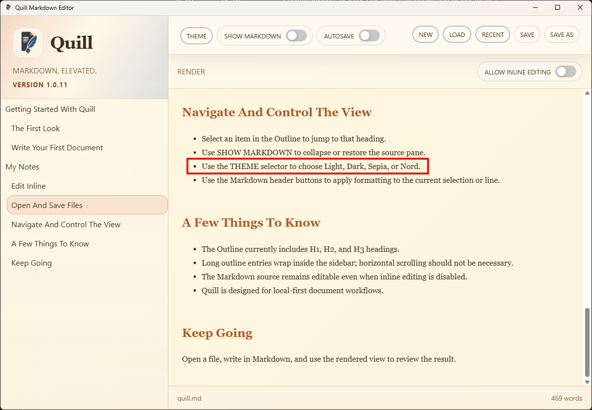

# TC-05 Evidence

| Field | Detail |
| --- | --- |
| PRD | [PRD-000009-UI](../../docs/25%20-%20Closed/PRD-000009-UI.md) |
| Acceptance Criteria | AC-07 |
| Product Version | 1.0.11 |
| Status | complete |
| Recorded | 2026-08-08T11:04:22.7984056Z |
| Test | Review the in-app usage and getting-started guidance for the expanded theme selector. |
| Result | PASS |

## Preconditions

- Quill product version `1.0.11` is installed or launched from the committed candidate.
- Quill is running and the in-app usage or getting-started guidance is accessible.
- The test document does not need to contain unsaved changes; this test checks guidance content only.

## Steps to Reproduce

1. Launch Quill version `1.0.11`.
2. Open the in-app usage or getting-started guidance.
3. Locate the instructions describing theme selection.
4. Confirm that the instructions describe choosing a named theme from the dropdown.
5. Confirm that the guidance names Light, Dark, Sepia, and Nord.
6. Search the guidance for any instruction to cycle through themes.
7. Record a screenshot or captured excerpt showing the relevant guidance.

## Expected Results

- The guidance explains that themes are selected by name from the theme dropdown.
- The guidance mentions Light, Dark, Sepia, and Nord.
- The guidance contains no instruction to cycle through themes.
- The guidance is readable and available from the normal in-app or getting-started documentation flow.

## Evidence

