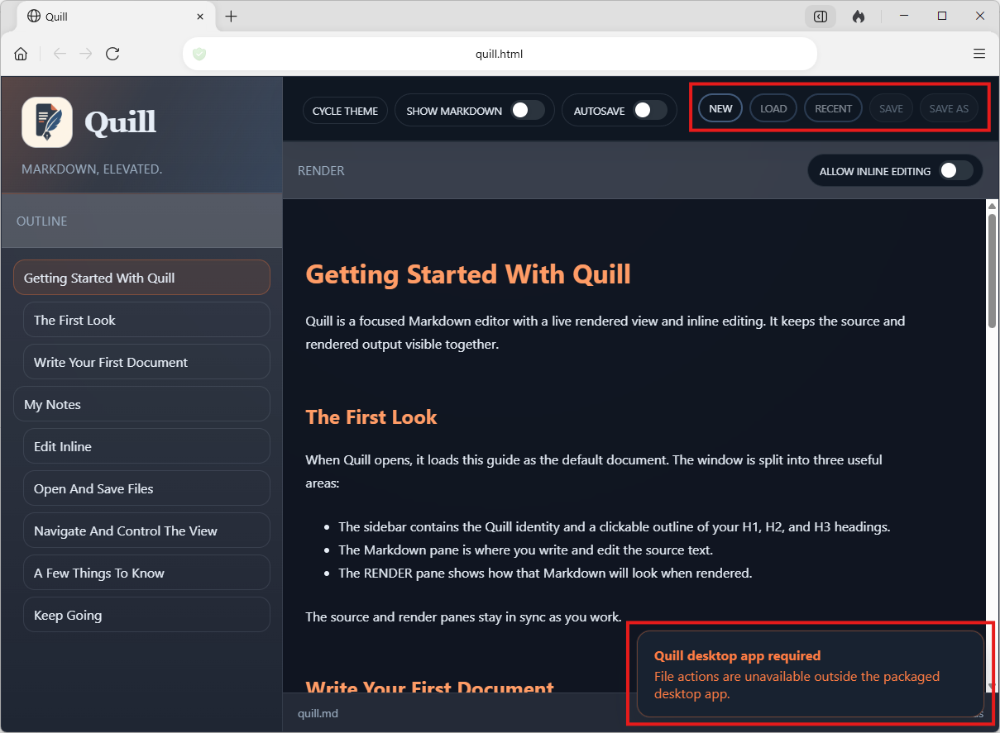

# TC-08 Evidence

| Field | Detail |
| --- | --- |
| PRD | [PRD-000020-CHANGE](../25%20-%20Closed/PRD-000020-CHANGE.md) |
| Acceptance Criteria | AC-06 |
| Product Version | 1.0.4 |
| Status | complete |
| Recorded | 2026-07-25T22:37:40.9458018Z |
| Test | Open Quill outside Tauri and verify file actions are unavailable without a browser fallback. |
| Result | PASS |

## Preconditions

> Legacy evidence record: this section was added to preserve the current evidence structure; no new test execution is implied.

## Steps to Reproduce

> Legacy evidence record: this section was added to preserve the current evidence structure; no new test execution is implied.

## Expected Results

> Legacy evidence record: this section was added to preserve the current evidence structure; no new test execution is implied.

## Evidence

