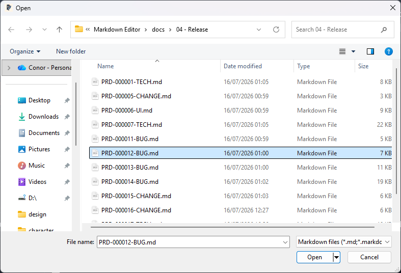
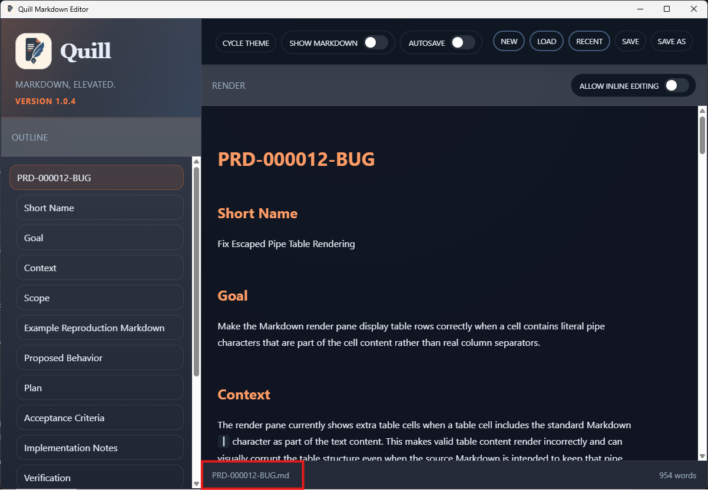
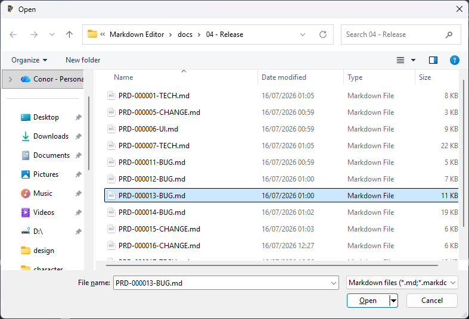
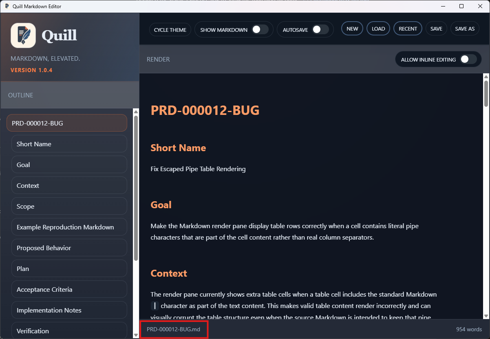

# TC-02 Evidence

| Field | Detail |
| --- | --- |
| PRD | [PRD-000020-CHANGE](../25%20-%20Closed/PRD-000020-CHANGE.md) |
| Acceptance Criteria | AC-02 |
| Product Version | 1.0.4 |
| Status | complete |
| Recorded | 2026-07-25T16:16:25.6889074Z |
| Completed | 2026-07-25T16:19:29.8555999Z |
| Test | Load a Markdown file, then cancel a second load without changing the document. |
| Result | Passed: the selected file opened and rendered; cancelling another selection left the loaded file and content unchanged. |

## Evidence

Selected Markdown file:

Loaded document:

Second file selected before cancellation:

Document unchanged after cancellation:

