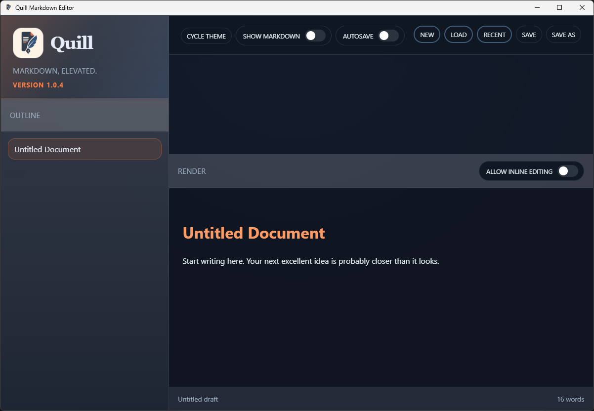
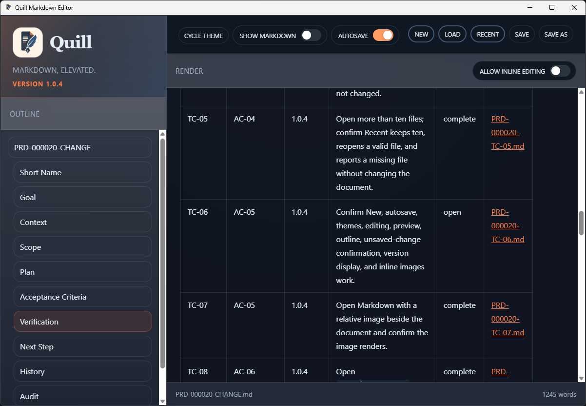
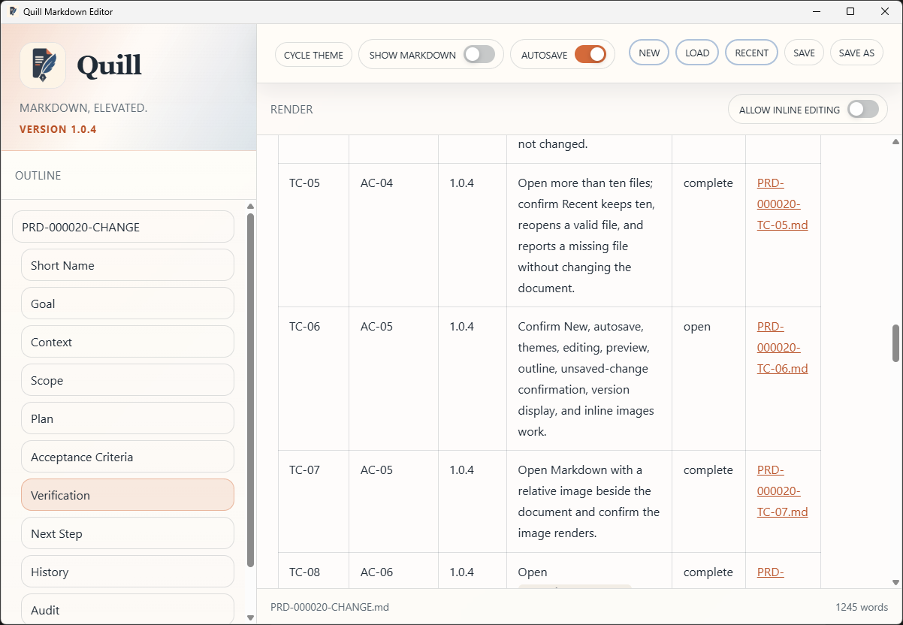
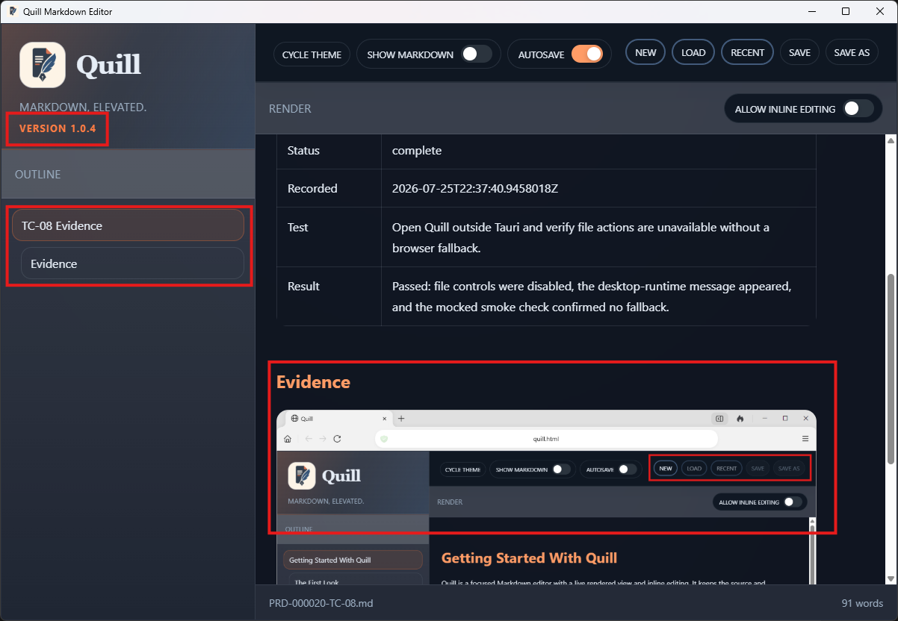
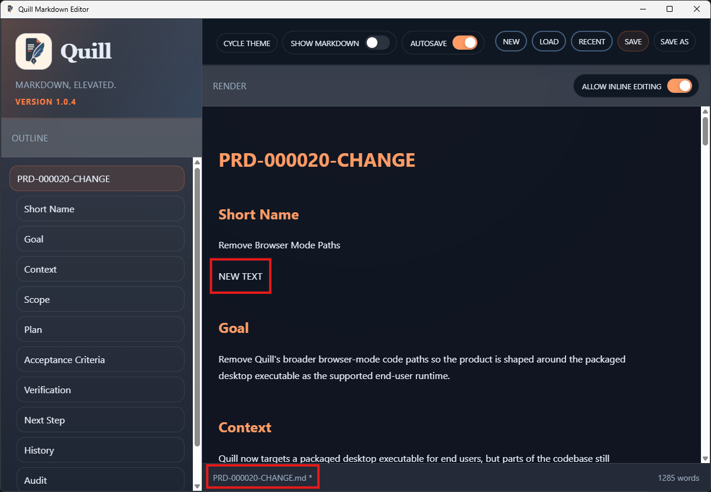
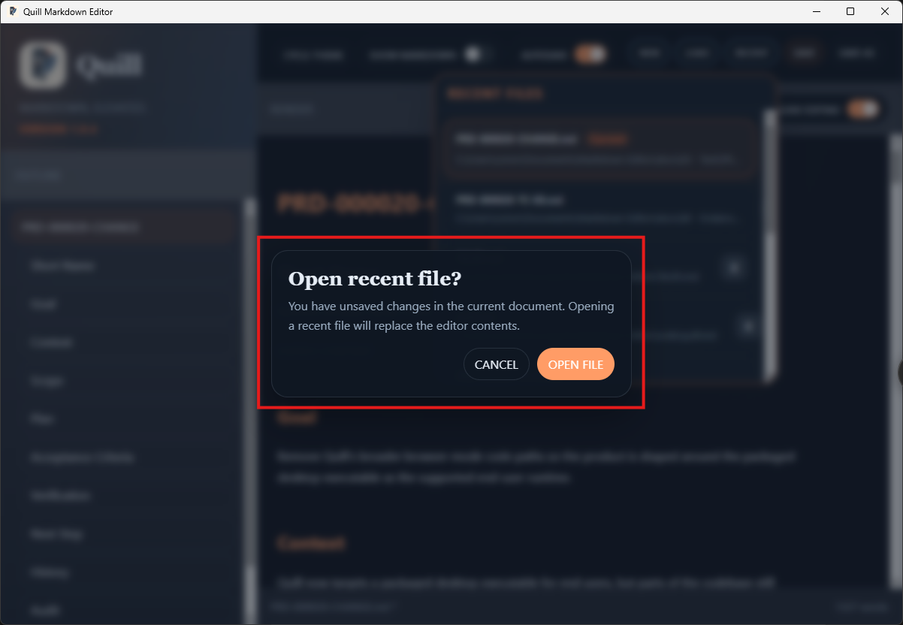
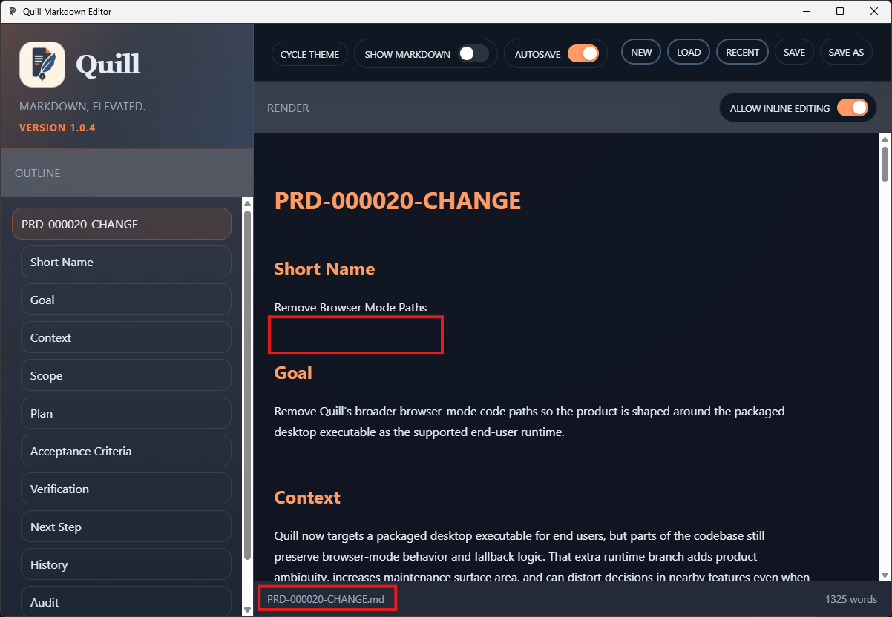

# TC-06 Evidence

| Field | Detail |
| --- | --- |
| PRD | [PRD-000020-CHANGE](../04%20-%20Release/PRD-000020-CHANGE.md) |
| Acceptance Criteria | AC-05 |
| Product Version | 1.0.4 |
| Status | complete |
| Recorded | 2026-07-25T22:48:45.7714549Z |
| Completed | 2026-07-25T23:18:13.2663330Z |
| Test | Verify core editor behavior still works. |
| Result | Passed: New, themes, editing, dirty state, preview, outline, confirmation, version display, and inline images worked. |

## Evidence

Dark theme:

Light theme:

Render, outline, version, and inline image:

Editing and dirty state:

Unsaved-change confirmation:

Recent action continued:

