# TC-05 Evidence

| Field | Detail |
| --- | --- |
| PRD | [PRD-000021-TECH](../../docs/25%20-%20Closed/PRD-000021-TECH.md) |
| Acceptance Criteria | AC-04 |
| Product Version | 1.1.0 |
| Status | complete |
| Recorded | 2026-08-29T16:03:14.8684428Z |
| Test | Manual packaged-desktop smoke check for core editor workflows. |
| Result | PASS |

## Preconditions

- Quill product candidate `1.1.0` is built from the committed `main` candidate.
- The packaged desktop executable or installer is available.
- A writable temporary Markdown file location is available for save and reload checks.

## Steps to Reproduce

1. Launch the packaged Quill desktop application and confirm the editor starts without an error state.
2. Edit Markdown containing a heading, paragraph, list, fenced code block, table, and image reference.
3. Confirm the preview, outline, word count, pane controls, and inline preview editing respond correctly.
4. Exercise New, Open, Save, Save As, and external-file/reload flows with representative Markdown content.
5. Open Recent Files, reopen an entry, and remove an entry.
6. Switch among the available themes and verify the content remains readable.
7. Exercise maximize and restore window controls.
8. Record the observed results and attach screenshots or logs to this evidence record.

## Expected Results

Quill starts and supports the scoped editing, rendering, file, Recent Files, theme, and maximize/restore workflows without substantive behavior regressions.

## Evidence

The startup check has been completed successfully: the packaged Quill `1.1.0` application opened without an error state and displayed the editor shell, default Getting Started document, Markdown pane, rendered preview, toolbar, and window controls.

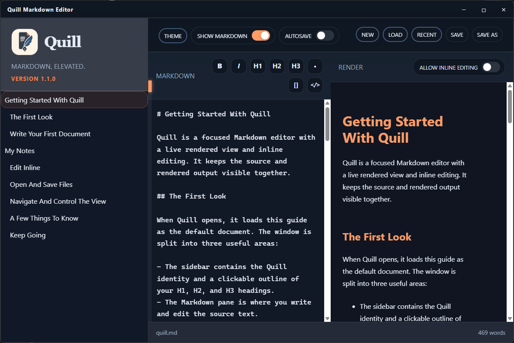

The heading and table editing check has also been completed successfully: inline editing was enabled, a rendered heading was edited, and a rendered table cell was edited while the preview remained active.

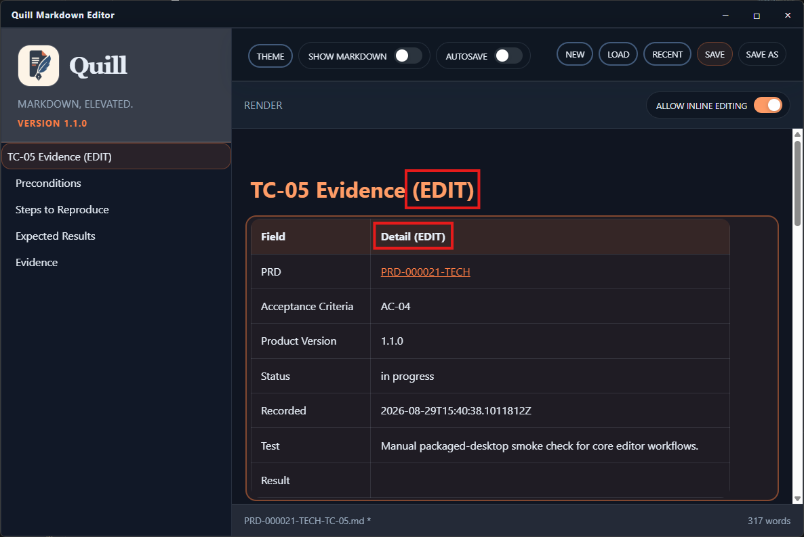

The file-open check has been completed successfully: the Open dialog displayed the evidence directory and its Markdown records, including the current TC-05 document.

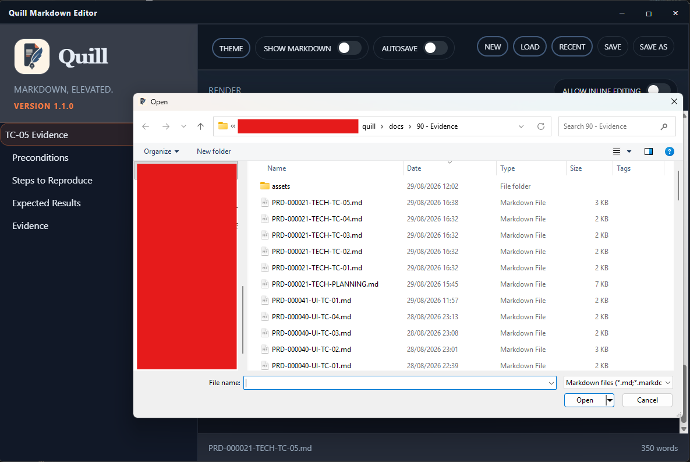

The Recent Files check has been completed successfully: the Recent Files panel displayed the current TC-05 document and prior test evidence entries, with the current file identified.

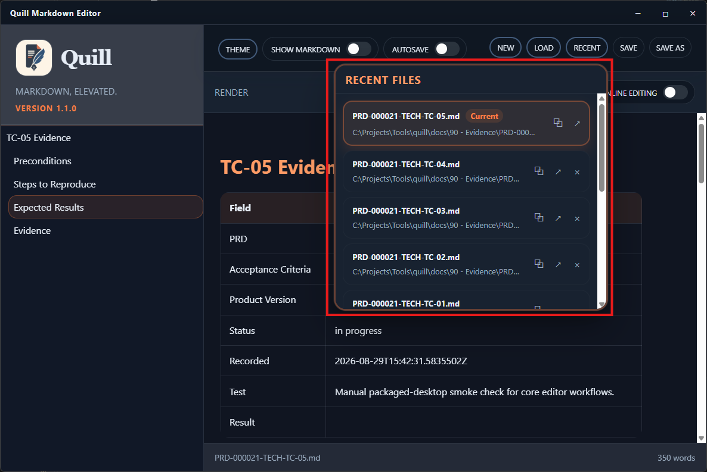

The Open in Explorer check has been completed successfully: Explorer opened to the `docs/90 - Evidence` directory from Quill, displaying the evidence files.

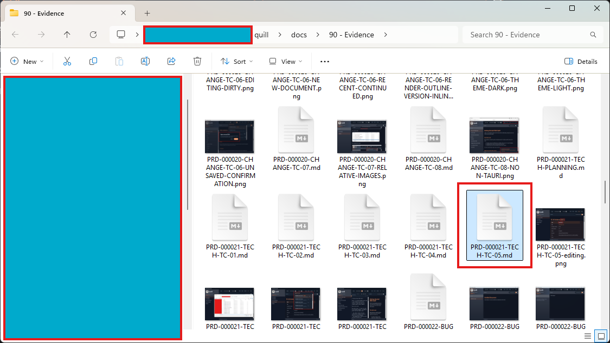

The maximize and restore checks have been completed successfully: the Quill window changed to maximized state and returned to its restored state using the custom window controls.

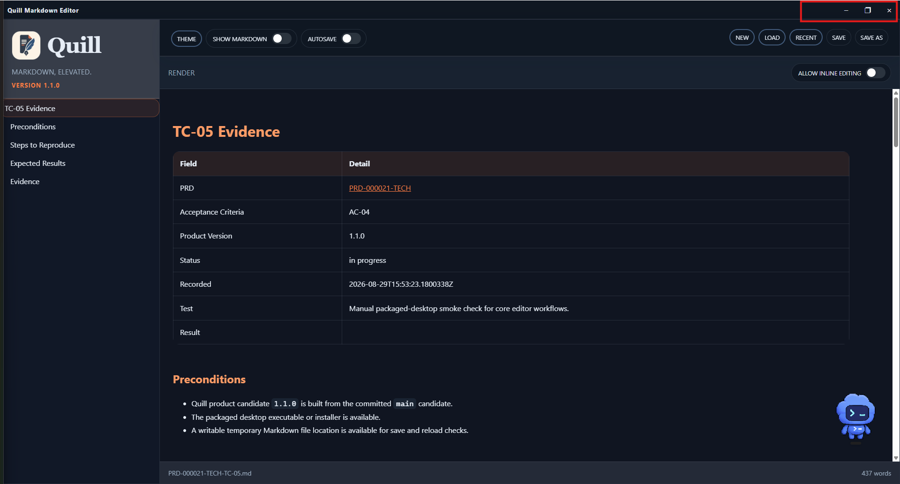

The editing and save interaction has been exercised: the TC-05 Markdown evidence document was edited in Quill, the Save control was activated, and the updated source was visible in the editor.

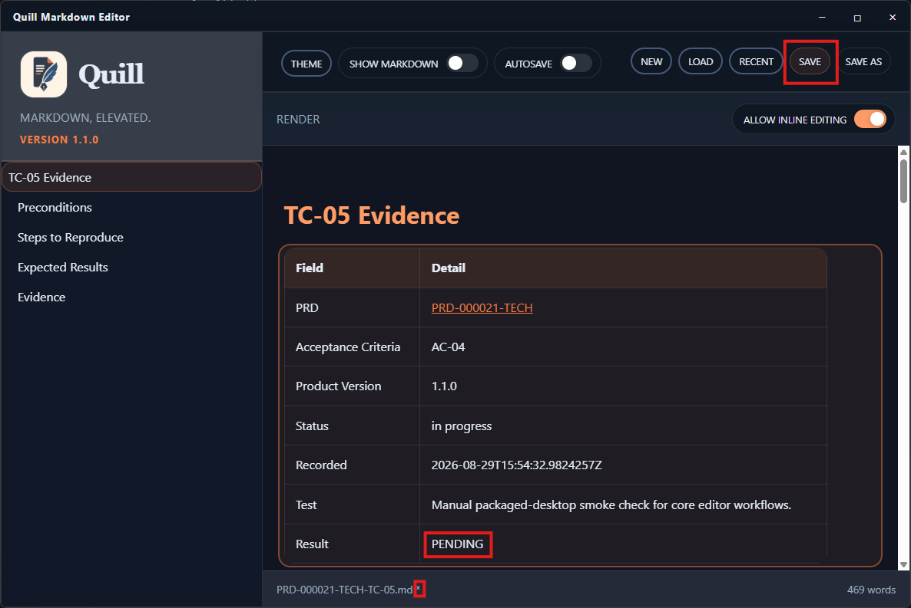

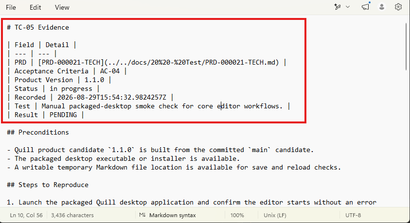

Save completion is now confirmed: the dirty-file marker is cleared after the Save action, and the edited TC-05 evidence content remains visible in the document.

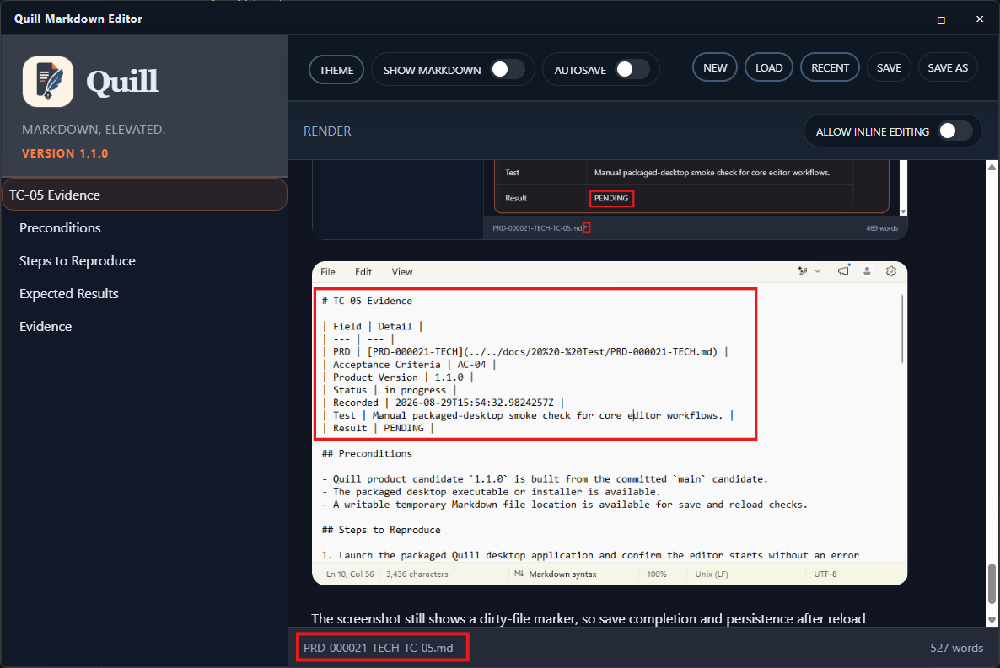

Persistence after reload is now confirmed: the edited TC-05 document reopened with its content intact, and the dirty-file marker was not present after reload.

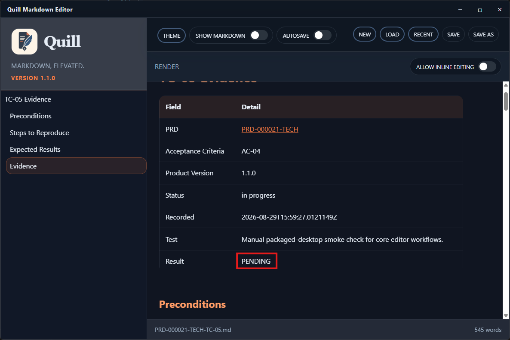

Theme behavior is now confirmed: the Theme chooser opened and the Sepia theme was applied successfully while the document remained readable.

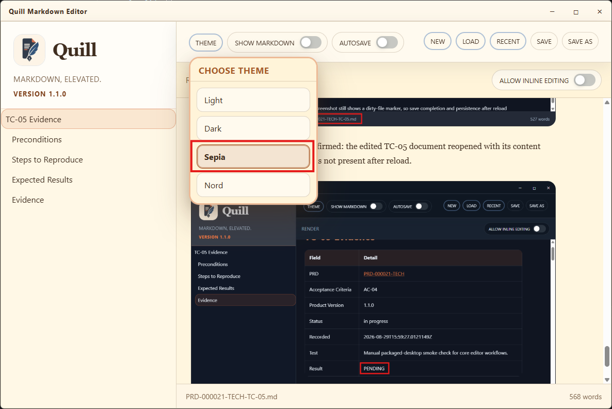

All checks in the scoped TC-05 case have been manually verified. Tauri bridge actions and close-control behavior are intentionally outside this test case.
