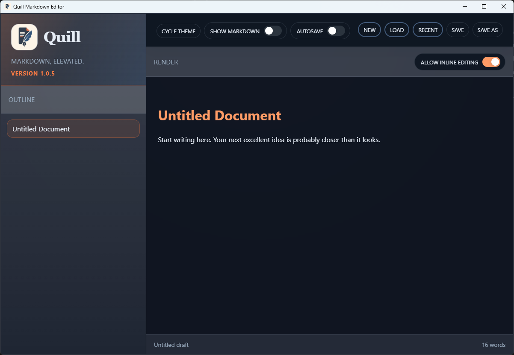

# TC-01 Evidence

| Field | Detail |
| --- | --- |
| PRD | [PRD-000022-BUG](../25%20-%20Closed/PRD-000022-BUG.md) |
| Acceptance Criteria | AC-01, AC-02 |
| Product Version | 1.0.5 |
| Status | complete |
| Recorded | 2026-08-04T22:49:35.4844698Z |
| Test | With Show Markdown disabled, inspect blank/new and short-content document states in Quill. Confirm that the Render pane begins immediately below its header, has no empty grid row above it, and extends to the application footer. |
| Result | PASS |

## Preconditions

> Legacy evidence record: this section was added to preserve the current evidence structure; no new test execution is implied.

## Steps to Reproduce

> Legacy evidence record: this section was added to preserve the current evidence structure; no new test execution is implied.

## Expected Results

> Legacy evidence record: this section was added to preserve the current evidence structure; no new test execution is implied.

## Evidence

