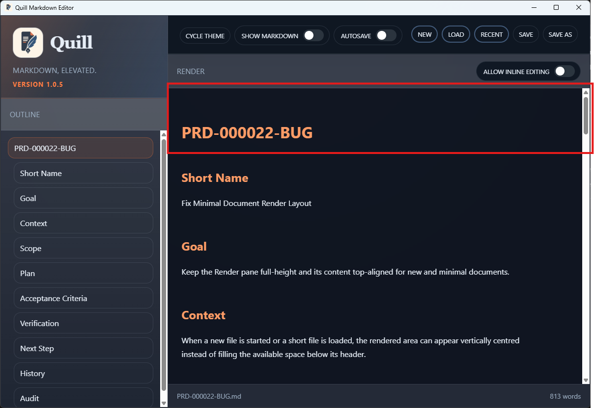

# TC-02 Evidence

| Field | Detail |
| --- | --- |
| PRD | [PRD-000022-BUG](../25%20-%20Closed/PRD-000022-BUG.md) |
| Acceptance Criteria | AC-03 |
| Product Version | 1.0.5 |
| Status | complete |
| Recorded | 2026-08-04T22:52:26.7827259Z |
| Test | With Show Markdown disabled, inspect the long PRD in the Render pane at its upper content area and near the lower Audit section. Confirm that the pane remains full-height, the content overflows within the Render area, and scrolling reaches both document positions while the pane header and application footer retain their positions. |
| Result | PASS |

## Preconditions

> Legacy evidence record: this section was added to preserve the current evidence structure; no new test execution is implied.

## Steps to Reproduce

> Legacy evidence record: this section was added to preserve the current evidence structure; no new test execution is implied.

## Expected Results

> Legacy evidence record: this section was added to preserve the current evidence structure; no new test execution is implied.

## Evidence

