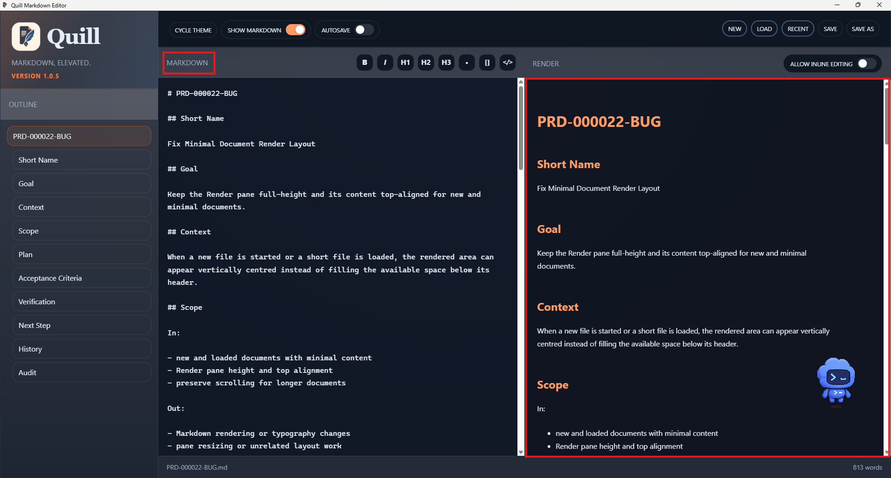

# TC-03 Evidence

| Field | Detail |
| --- | --- |
| PRD | [PRD-000022-BUG](../25%20-%20Closed/PRD-000022-BUG.md) |
| Acceptance Criteria | AC-04 |
| Product Version | 1.0.5 |
| Status | complete |
| Recorded | 2026-08-04T22:57:51.7186778Z |
| Test | With Show Markdown enabled after the Render-only checks, inspect the loaded PRD and confirm that the Markdown and Render panes return to the existing two-column layout with their headers, content areas, and scroll regions visible. |
| Result | PASS |

## Preconditions

> Legacy evidence record: this section was added to preserve the current evidence structure; no new test execution is implied.

## Steps to Reproduce

> Legacy evidence record: this section was added to preserve the current evidence structure; no new test execution is implied.

## Expected Results

> Legacy evidence record: this section was added to preserve the current evidence structure; no new test execution is implied.

## Evidence

