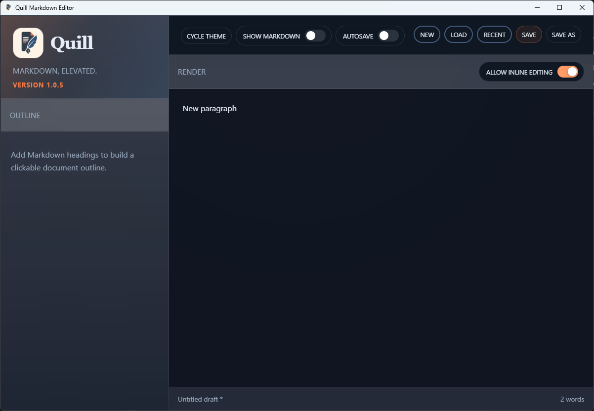

# TC-01 Evidence

| Field | Detail |
| --- | --- |
| PRD | [PRD-000022-BUG](../04%20-%20Release/PRD-000022-BUG.md) |
| Acceptance Criteria | AC-01, AC-02 |
| Product Version | 1.0.5 |
| Status | complete |
| Recorded | 2026-08-04T22:49:35.4844698Z |
| Test | With Show Markdown disabled, inspect blank/new and short-content document states in Quill. Confirm that the Render pane begins immediately below its header, has no empty grid row above it, and extends to the application footer. |
| Result | Both supplied screenshots show version 1.0.5 with Show Markdown disabled. The Render pane begins at the top of the workspace below the Render header, the displayed content is top-aligned within the pane, and the pane extends continuously to the footer. Screenshot 1 shows the blank/new Untitled Document state; Screenshot 2 shows the short `New paragraph` state. |

## Evidence

