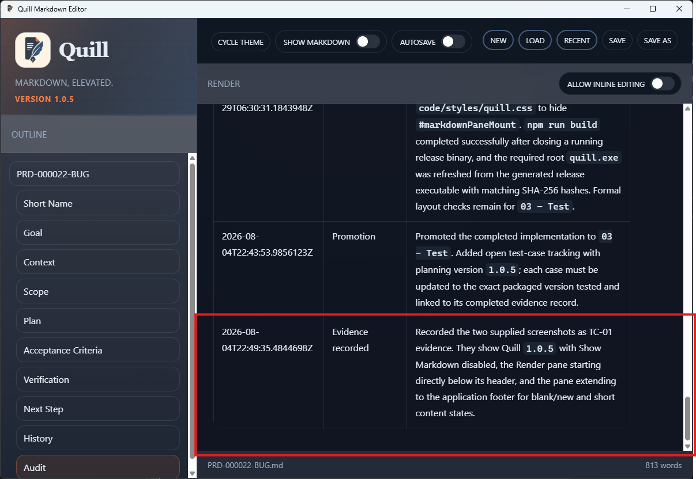

# TC-02 Evidence

| Field | Detail |
| --- | --- |
| PRD | [PRD-000022-BUG](../25%20-%20Closed/PRD-000022-BUG.md) |
| Acceptance Criteria | AC-03 |
| Product Version | 1.0.5 |
| Status | complete |
| Recorded | 2026-08-04T22:52:26.7827259Z |
| Test | With Show Markdown disabled, inspect the long PRD in the Render pane at its upper content area and near the lower Audit section. Confirm that the pane remains full-height, the content overflows within the Render area, and scrolling reaches both document positions while the pane header and application footer retain their positions. |
| Result | Both supplied screenshots show version 1.0.5 with Show Markdown disabled and the Render pane extending from its header to the footer. Screenshot 1 shows the document near its top, beginning with `PRD-000022-BUG`; Screenshot 2 shows the lower Audit content, including the TC-01 evidence entry, with the Render scrollbar near the bottom. |

## Evidence

