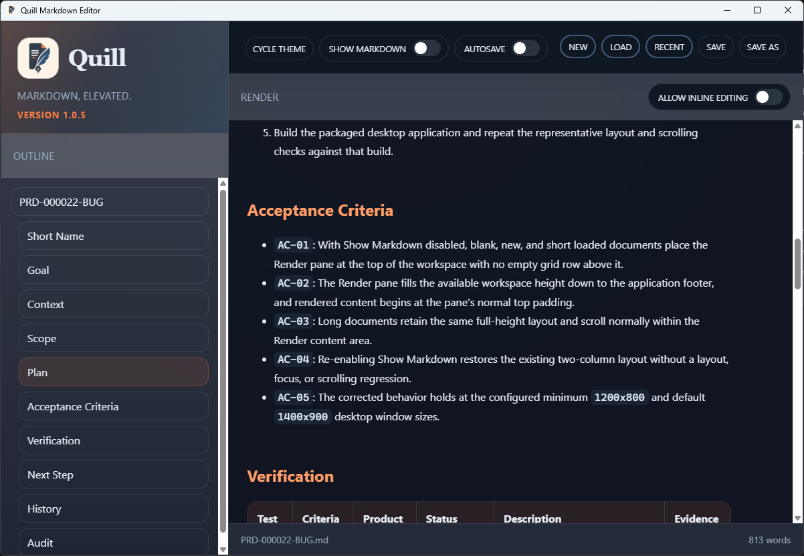
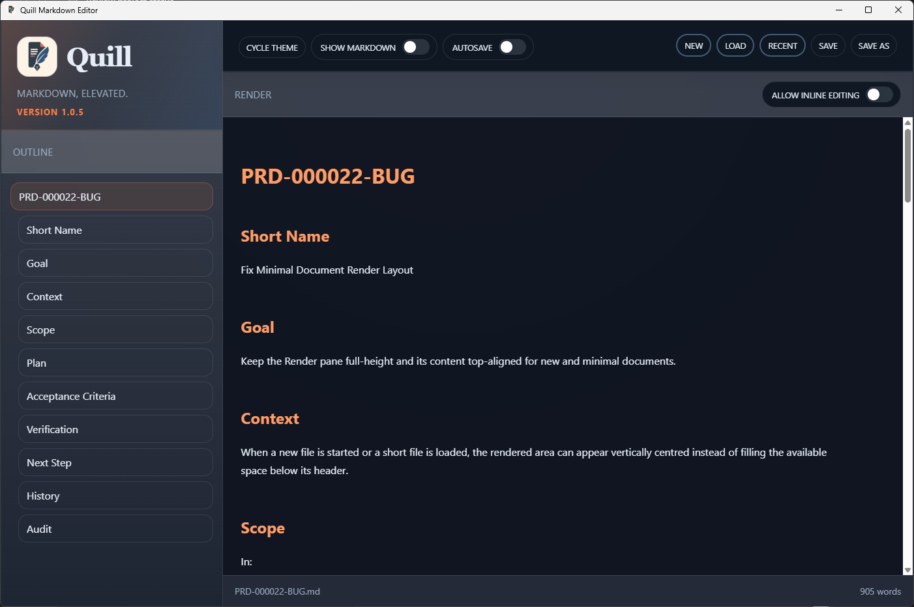

# TC-04 Evidence

| Field | Detail |
| --- | --- |
| PRD | [PRD-000022-BUG](../25%20-%20Closed/PRD-000022-BUG.md) |
| Acceptance Criteria | AC-05 |
| Product Version | 1.0.5 |
| Status | complete |
| Recorded | 2026-08-04T23:01:14.8805605Z |
| Test | Repeat the Render-only layout check at the configured minimum `1200x800` and default `1400x900` desktop window sizes. Confirm that the Render pane fills the available workspace below its header, remains top-aligned, and retains normal document scrolling. |
| Result | The supplied screenshots show version 1.0.5 with Show Markdown disabled at both required sizes. The minimum-size screenshot shows the Render pane filling the available height with the document content visible and scrollable; the default-size screenshot shows the same full-height, top-aligned layout at the larger window size. |

## Evidence

