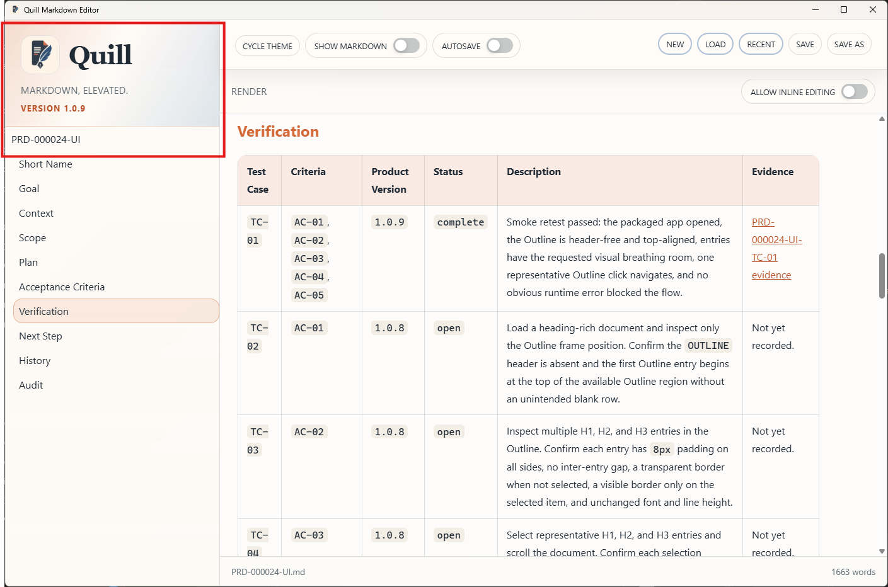

# PRD-000024-TC-02 Evidence

| Field | Detail |
| --- | --- |
| PRD | [PRD-000024-UI](../../docs/20%20-%20Test/PRD-000024-UI.md) |
| Acceptance Criteria | AC-01 |
| Product Version | 1.0.9 |
| Git Commit | [ea6f0aa](https://github.com/conorheaney/quill/commit/ea6f0aa7366722cde18abb0883c3916213aada40) |
| Status | complete |
| Recorded | 2026-08-07T16:27:07.4405207Z |
| Test | Load a heading-rich document and inspect only the Outline frame position. Confirm the `OUTLINE` header is absent and the first Outline entry begins at the top of the available Outline region without an unintended blank row. |
| Result | Passed. The supplied screenshot of the packaged Quill `1.0.9` candidate shows no visible `OUTLINE` header and the first Outline entry begins directly below the product identity area at the top of the available Outline region. |

## Evidence

