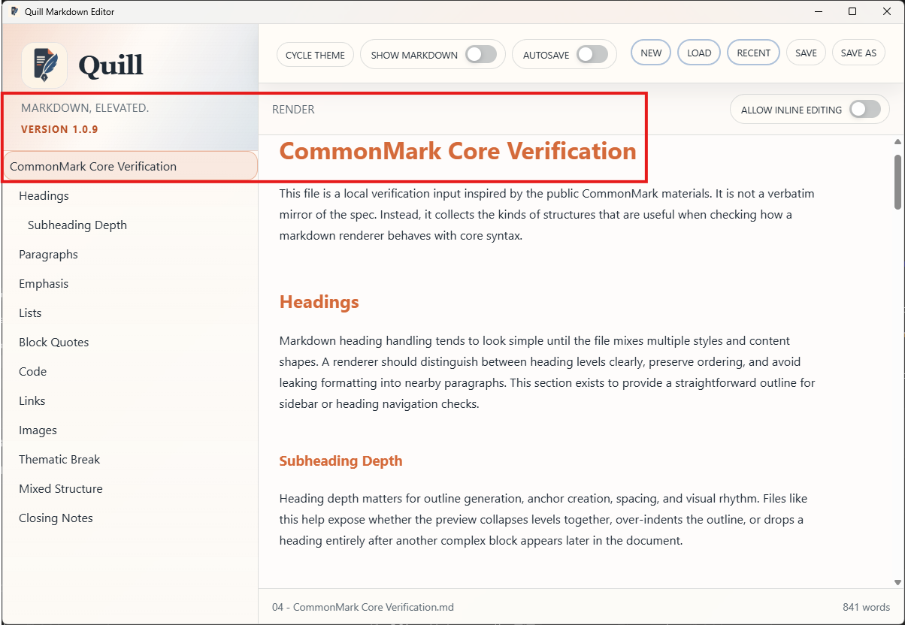
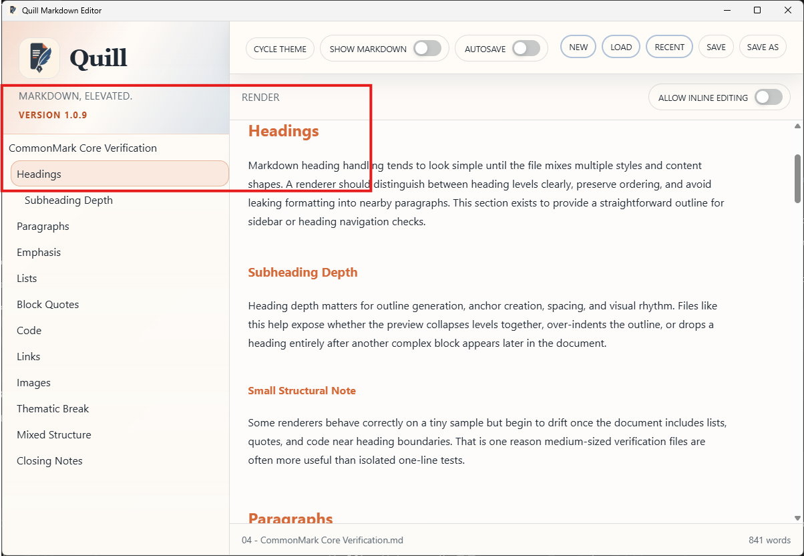

# PRD-000024-TC-04 Evidence

| Field | Detail |
| --- | --- |
| PRD | [PRD-000024-UI](../../docs/20%20-%20Test/PRD-000024-UI.md) |
| Acceptance Criteria | AC-03 |
| Product Version | 1.0.9 |
| Git Commit | [ea6f0aa](https://github.com/conorheaney/quill/commit/ea6f0aa7366722cde18abb0883c3916213aada40) |
| Status | complete |
| Recorded | 2026-08-07T16:41:56.0189374Z |
| Test | Select representative H1, H2, and H3 entries and scroll the document. Confirm each selection navigates to its matching heading and the active-entry highlight tracks the current heading. |
| Result | Passed. The three supplied screenshots show the Outline selection and rendered document aligned for the H1 `CommonMark Core Verification`, H2 `Headings`, and H3 `Subheading Depth` targets. Each selected Outline entry is highlighted and the corresponding heading is positioned in the document view. |

## Evidence

### H1 navigation

### H2 navigation

### H3 navigation

