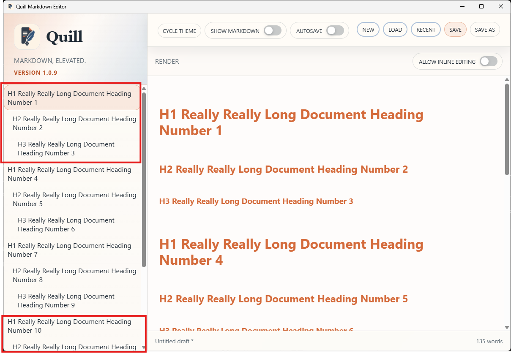

# PRD-000024-TC-05 Evidence

| Field | Detail |
| --- | --- |
| PRD | [PRD-000024-UI](../../docs/20%20-%20Test/PRD-000024-UI.md) |
| Acceptance Criteria | AC-04 |
| Product Version | 1.0.9 |
| Git Commit | [ea6f0aa](https://github.com/conorheaney/quill/commit/ea6f0aa7366722cde18abb0883c3916213aada40) |
| Status | complete |
| Recorded | 2026-08-07T16:46:37.9377823Z |
| Test | Use a document containing a long heading and enough headings to exceed the available Outline height. Confirm long text wraps within the pane and the Outline scroll reaches entries outside the initial viewport. |
| Result | Passed. The supplied screenshot of the packaged Quill `1.0.9` candidate shows long H1, H2, and H3 Outline entries wrapping within the pane, with the Outline scrollbar extending through entries beyond the initial viewport. The rendered document also shows wrapped long headings and an active document scrollbar. |

## Evidence

