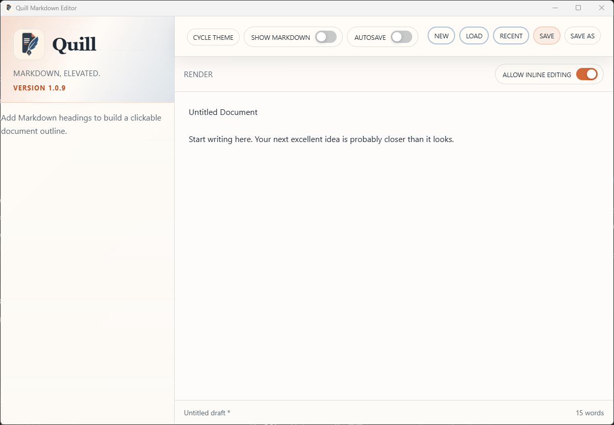

# PRD-000024-TC-06 Evidence

| Field | Detail |
| --- | --- |
| PRD | [PRD-000024-UI](../../docs/20%20-%20Test/PRD-000024-UI.md) |
| Acceptance Criteria | AC-05 |
| Product Version | 1.0.9 |
| Git Commit | [ea6f0aa](https://github.com/conorheaney/quill/commit/ea6f0aa7366722cde18abb0883c3916213aada40) |
| Status | complete |
| Recorded | 2026-08-07T16:49:14.2539519Z |
| Test | Open a document without headings. Confirm the existing empty-state message is shown and the sidebar identity and unrelated controls remain unchanged. |
| Result | Passed. The supplied screenshot of the packaged Quill `1.0.9` candidate shows the no-headings empty-state guidance, the Quill identity area with version `1.0.9`, and the surrounding document controls in the compact headerless layout. |

## Evidence

