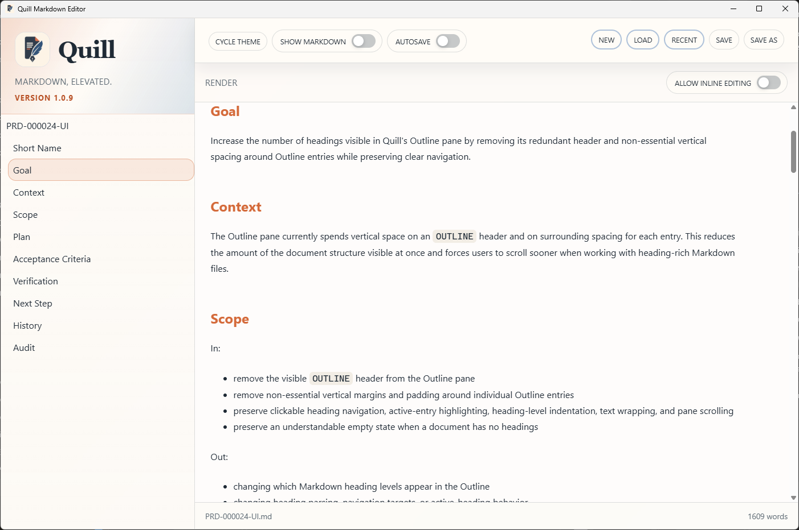
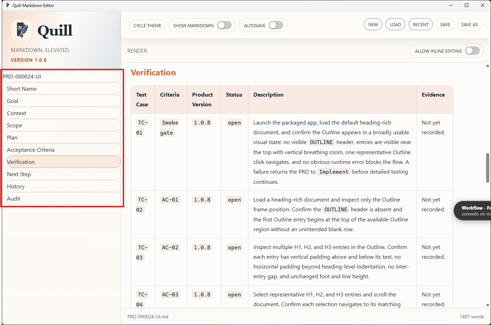

# PRD-000024-UI-TC-01 Evidence

| Field | Detail |
| --- | --- |
| PRD | [PRD-000024-UI](../../docs/25%20-%20Closed/PRD-000024-UI.md) |
| Acceptance Criteria | AC-01, AC-02, AC-03, AC-04, AC-05 |
| Product Version | 1.0.9 |
| Status | complete |
| Recorded | 2026-08-07T16:20:02.2635676Z |
| Test | Retest the packaged Quill 1.0.9 candidate after the TC-01 visual correction. Launch the app, load the heading-rich verification document, inspect the Outline visual state, and perform one representative Outline navigation action. |
| Result | PASS |

## Preconditions

> Legacy evidence record: this section was added to preserve the current evidence structure; no new test execution is implied.

## Steps to Reproduce

> Legacy evidence record: this section was added to preserve the current evidence structure; no new test execution is implied.

## Expected Results

> Legacy evidence record: this section was added to preserve the current evidence structure; no new test execution is implied.

## Evidence

### Passing retest

### Superseded failure

