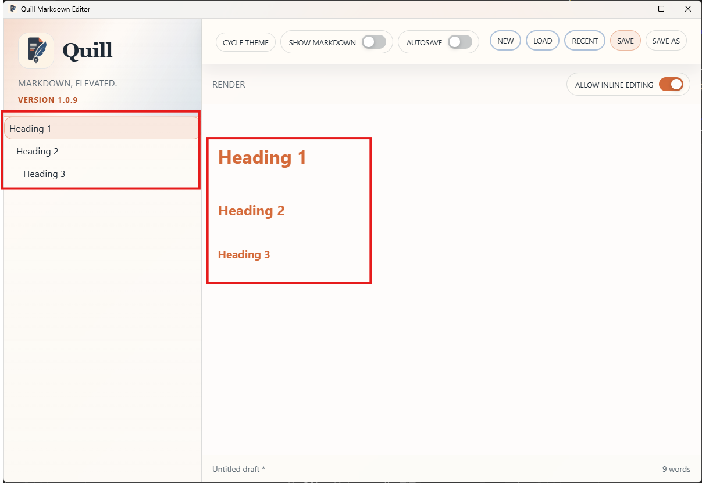

# PRD-000024-UI-TC-03 Evidence

| Field | Detail |
| --- | --- |
| PRD | [PRD-000024-UI](../../docs/25%20-%20Closed/PRD-000024-UI.md) |
| Acceptance Criteria | AC-02 |
| Product Version | 1.0.9 |
| Status | complete |
| Recorded | 2026-08-07T16:30:11.1058608Z |
| Test | Inspect multiple H1, H2, and H3 entries in the Outline. Confirm each entry has `8px` padding on all sides, no inter-entry gap, a transparent border when not selected, a visible border only on the selected item, and unchanged font and line height. |
| Result | PASS |

## Preconditions

> Legacy evidence record: this section was added to preserve the current evidence structure; no new test execution is implied.

## Steps to Reproduce

> Legacy evidence record: this section was added to preserve the current evidence structure; no new test execution is implied.

## Expected Results

> Legacy evidence record: this section was added to preserve the current evidence structure; no new test execution is implied.

## Evidence

