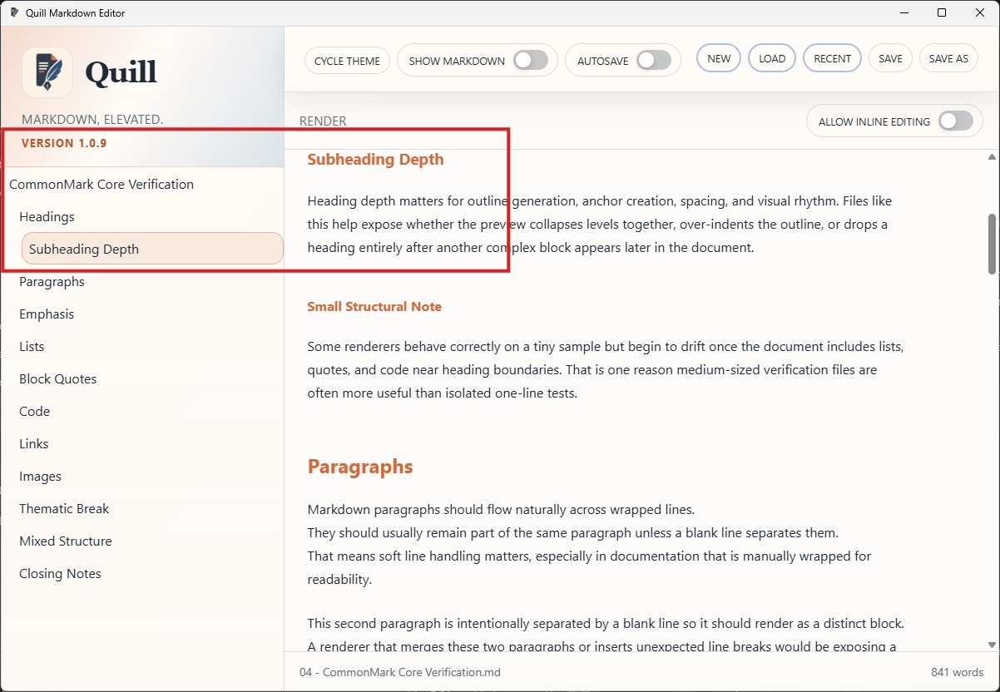

# PRD-000024-UI-TC-04 Evidence

| Field | Detail |
| --- | --- |
| PRD | [PRD-000024-UI](../../docs/25%20-%20Closed/PRD-000024-UI.md) |
| Acceptance Criteria | AC-03 |
| Product Version | 1.0.9 |
| Status | complete |
| Recorded | 2026-08-07T16:41:56.0189374Z |
| Test | Select representative H1, H2, and H3 entries and scroll the document. Confirm each selection navigates to its matching heading and the active-entry highlight tracks the current heading. |
| Result | PASS |

## Preconditions

> Legacy evidence record: this section was added to preserve the current evidence structure; no new test execution is implied.

## Steps to Reproduce

> Legacy evidence record: this section was added to preserve the current evidence structure; no new test execution is implied.

## Expected Results

> Legacy evidence record: this section was added to preserve the current evidence structure; no new test execution is implied.

## Evidence

### H1 navigation

### H2 navigation

### H3 navigation

