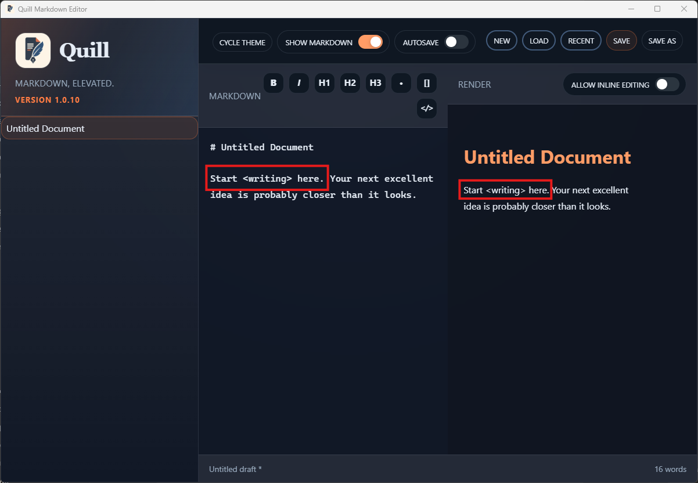

# TC-01 Evidence

| Field | Detail |
| --- | --- |
| PRD | [PRD-000025-BUG](../../docs/25%20-%20Closed/PRD-000025-BUG.md) |
| Acceptance Criteria | AC-01 |
| Product Version | 1.0.10 |
| Git Commit | [e17107177ce297b0d206f3437d295a0821df3f58](https://github.com/conorheaney/quill/commit/e17107177ce297b0d206f3437d295a0821df3f58) |
| Status | complete |
| Recorded | 2026-08-07T22:57:42.8962437Z |
| Test | In Quill 1.0.10, render a normal paragraph containing literal angle-bracket text and inspect the Render pane. |
| Result | Pass for the supplied representative case: *<writing>* remains visible in the rendered paragraph beside the Markdown source. The screenshot uses **<writing>** rather than the exact **<TEST>** sample. |

## Evidence

