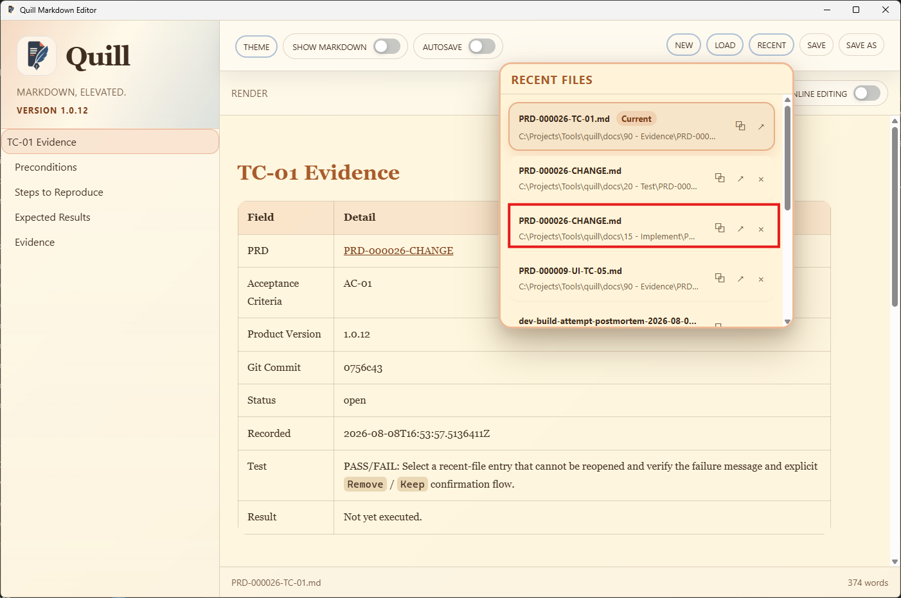
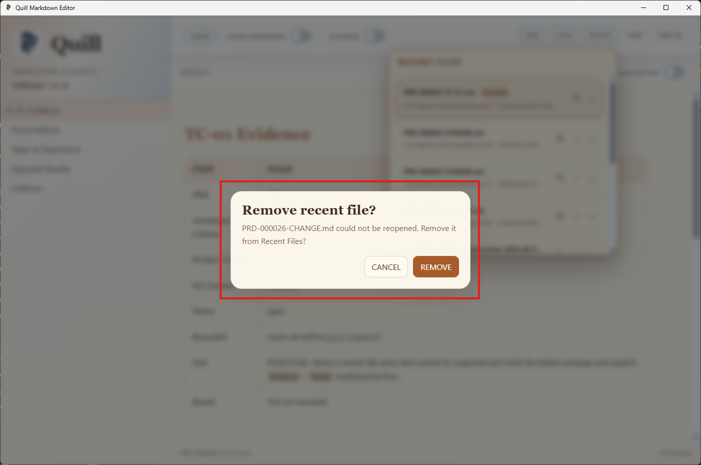
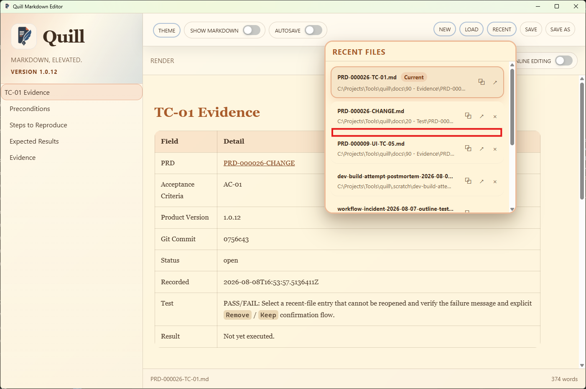

# TC-01 Evidence

| Field | Detail |
| --- | --- |
| PRD | [PRD-000026-CHANGE](../../docs/20%20-%20Test/PRD-000026-CHANGE.md) |
| Acceptance Criteria | AC-01 |
| Product Version | 1.0.12 |
| Status | complete |
| Recorded | 2026-08-08T17:00:36.5774321Z |
| Test | PASS/FAIL: Select a recent-file entry that cannot be reopened and verify the failure message and explicit removal-preservation confirmation flow. |
| Result | PASS: The supplied evidence shows the failed-reopen dialog for `PRD-000026-CHANGE.md`, then shows that the entry is absent from Recent Files after `REMOVE` is clicked. |

## Preconditions

- Run the packaged Quill `1.0.12` candidate.
- Have at least one recent-file entry whose path cannot be reopened, such as a file that has been moved or deleted outside Quill.
- Ensure the Recent Files list contains the target entry before making it unavailable.
- Keep the current document in a state where the standard unsaved-change confirmation can be observed if applicable.

## Steps to Reproduce

1. Open Quill and open the Recent Files panel.
2. Confirm that opening the panel does not perform a proactive availability check or remove the target entry.
3. Make the target recent file unavailable outside Quill by moving or deleting it, if this was not done during setup.
4. Open the Recent Files panel and select the target entry.
5. Observe the failed-reopen message and the explicit `Remove` / `Cancel` confirmation dialog.
6. Select `Cancel` and confirm that the entry remains in the list without a persistent or transient failure marker.
7. Select the target entry again, choose `Remove`, and confirm that the entry is deleted from the Recent Files list.

## Expected Results

- Quill does not perform a filesystem or network availability check merely because the Recent Files panel opens.
- Selecting the unavailable entry attempts the reopen and reports that the file could not be opened.
- Quill presents explicit `Remove` and `Cancel` choices after the failed reopen.
- `Cancel` preserves the recent entry for a later retry and leaves its row visually unchanged.
- `Remove` deletes the failed entry from the Recent Files list.
- The failed-reopen flow does not silently replace the current document or discard its unsaved state.

## Evidence

The first screenshot shows the Recent Files panel in Quill `1.0.12`, including the current entry and recent-file rows.

The second screenshot shows the failed-reopen confirmation for `PRD-000026-CHANGE.md`. The visible choices are `CANCEL` and `REMOVE`; `CANCEL` is the specified preserve-entry action.

The third screenshot shows `PRD-000026-CHANGE.md` absent from the Recent Files list after `REMOVE` was clicked.

