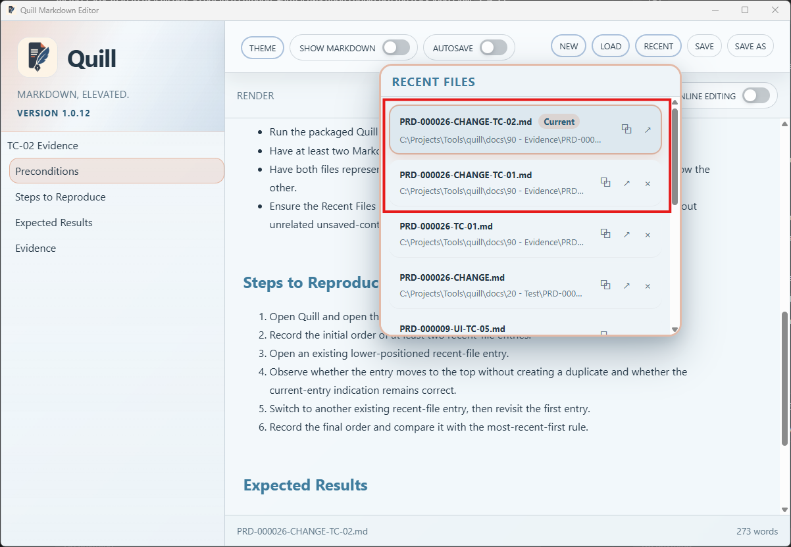
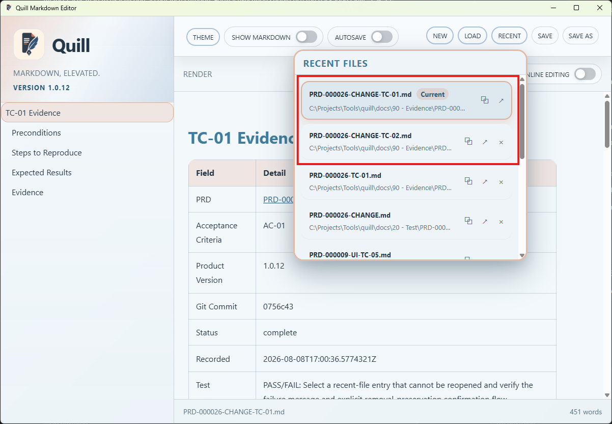

# TC-02 Evidence

| Field | Detail |
| --- | --- |
| PRD | [PRD-000026-CHANGE](../../docs/20%20-%20Test/PRD-000026-CHANGE.md) |
| Acceptance Criteria | AC-02 |
| Product Version | 1.0.12 |
| Status | complete |
| Recorded | 2026-08-08T18:12:11.6246656Z |
| Test | PASS/FAIL: Open, switch, and revisit recent files to verify most-recent-first ordering, duplicate handling, and the current-entry indication. |
| Result | PASS: The supplied screenshots show `TC-02` as the current recent file at the top of the list, followed by the `TC-01` entries. After switching, `TC-01` is shown as the current top entry and `TC-02` follows it, demonstrating most-recent-first ordering and correct current-entry indication. |

## Preconditions

- Run the packaged Quill `1.0.12` candidate.
- Have at least two Markdown files available to open through Quill.
- Have both files represented in the Recent Files list, with one entry already positioned below the other.
- Ensure the Recent Files panel is available and the current document can be changed without unrelated unsaved-content interruptions.

## Steps to Reproduce

1. Open Quill and open the Recent Files panel.
2. Record the initial order of at least two recent-file entries.
3. Open an existing lower-positioned recent-file entry.
4. Observe whether the entry moves to the top without creating a duplicate and whether the current-entry indication remains correct.
5. Switch to another existing recent-file entry, then revisit the first entry.
6. Record the final order and compare it with the most-recent-first rule.

## Expected Results

- Recent Files retains most-recent-first ordering after an existing entry is opened.
- Switching and revisiting entries does not create duplicate rows or break the current-entry indication.

## Evidence

The first screenshot shows `PRD-000026-CHANGE-TC-02.md` as the current entry at the top of Recent Files.

The second screenshot shows `PRD-000026-CHANGE-TC-01.md` as the current entry at the top, with the previously current `TC-02` entry below it.

