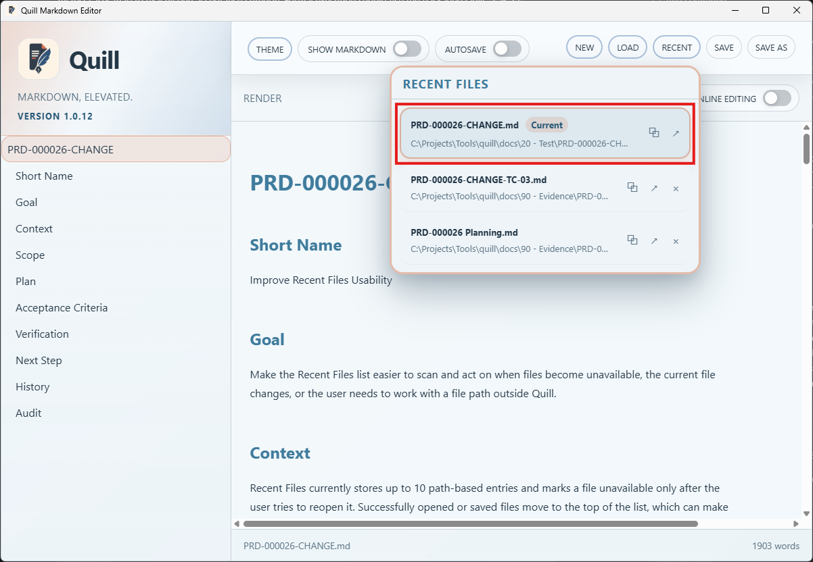
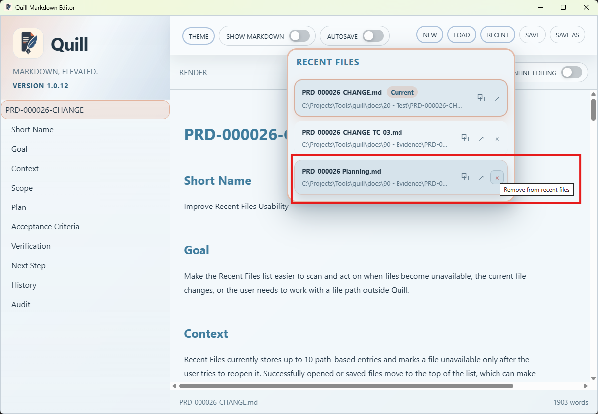

# TC-03 Evidence

| Field | Detail |
| --- | --- |
| PRD | [PRD-000026-CHANGE](../../docs/20%20-%20Test/PRD-000026-CHANGE.md) |
| Acceptance Criteria | AC-03 |
| Product Version | 1.0.12 |
| Status | complete |
| Recorded | 2026-08-08T18:14:21.4362218Z |
| Test | PASS/FAIL: Verify the Recent Files action cluster is visible within each file item and right-aligned, the overlaid Remove control works without opening the file, and the current file does not expose Remove. |
| Result | PASS: The action line is functionally correct and right-aligned within the file item. The Remove control works without opening the file, and the current file does not expose Remove. The action line is not on the same line as the file entry; AC-03 was clarified to accept this layout. |

## Preconditions

- Run the packaged Quill `1.0.12` candidate.
- Populate Recent Files with at least two entries.
- Ensure one entry is the current document and another entry is removable.
- Open the Recent Files panel.

## Steps to Reproduce

1. Inspect the Recent Files rows and identify the action icons or glyphs on each row.
2. Confirm the action cluster is within the file item and aligned to the right.
3. On a non-current row, select the overlaid Remove control.
4. Observe whether the remove action is selected without opening the file.
5. Inspect the current-file row and confirm whether it exposes a Remove control.

## Expected Results

- Each Recent Files item displays a compact action cluster within the item and aligned to the right; the action line may occupy its own row area.
- A removable row displays an overlaid Remove control within the file item panel.
- Selecting Remove removes the targeted entry without opening or selecting that file.
- The current-file row does not display a Remove control.

## Evidence

Shows the current entry marked `Current`, with Copy Path and Open in Explorer actions visible and no Remove action.

Shows the right-aligned action area and the Remove control tooltip, `Remove from recent files`.

The screenshots confirm the action line is within the file item and right-aligned, although it is not on the same line as the file entry.

The layout difference is accepted as a documentation-level clarification; no implementation change was made.
