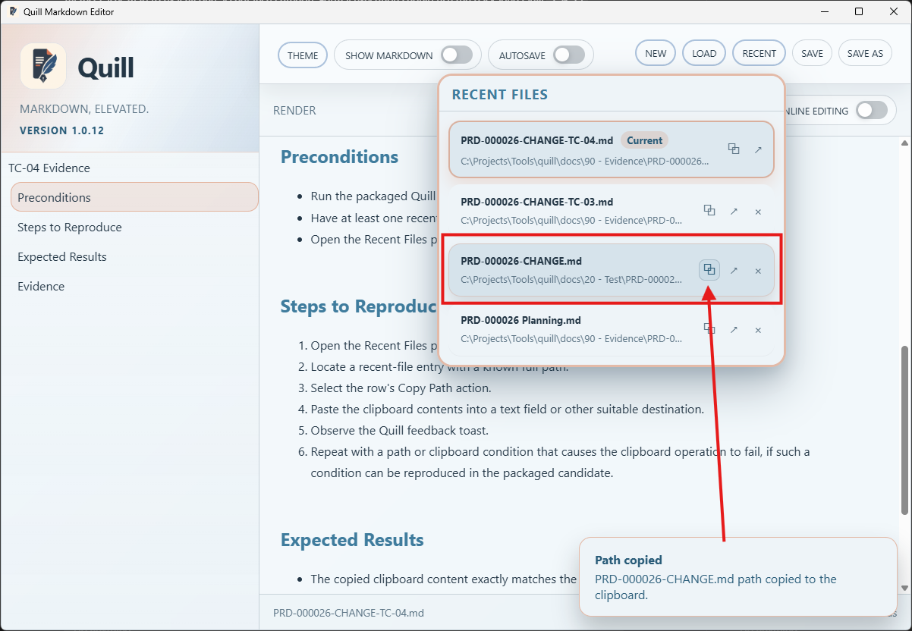
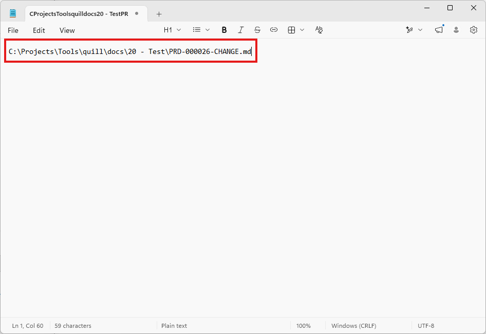

# TC-04 Evidence

| Field | Detail |
| --- | --- |
| PRD | [PRD-000026-CHANGE](../../docs/20%20-%20Test/PRD-000026-CHANGE.md) |
| Acceptance Criteria | AC-04 |
| Product Version | 1.0.12 |
| Status | complete |
| Recorded | 2026-08-08T18:35:39.6921079Z |
| Test | PASS/FAIL: Copy a recent file's full path to the clipboard and verify concise success or failure toast feedback. |
| Result | PASS: Quill displayed the `Path copied` toast after the Copy Path action, and the pasted value matched the full path of `PRD-000026-CHANGE.md`. |

## Preconditions

- Run the packaged Quill `1.0.12` candidate.
- Have at least one recent-file entry with a known full path.
- Open the Recent Files panel.

## Steps to Reproduce

1. Open the Recent Files panel.
2. Locate a recent-file entry with a known full path.
3. Select the row's Copy Path action.
4. Paste the clipboard contents into a text field or other suitable destination.
5. Observe the Quill feedback toast.
6. Observe that the copied value is available in the external text editor.

## Expected Results

- The copied clipboard content exactly matches the recent entry's full file path.
- A concise success toast appears when the clipboard write succeeds.
- The supplied evidence shows the success toast and the exact copied full path in an external text editor.

## Evidence

