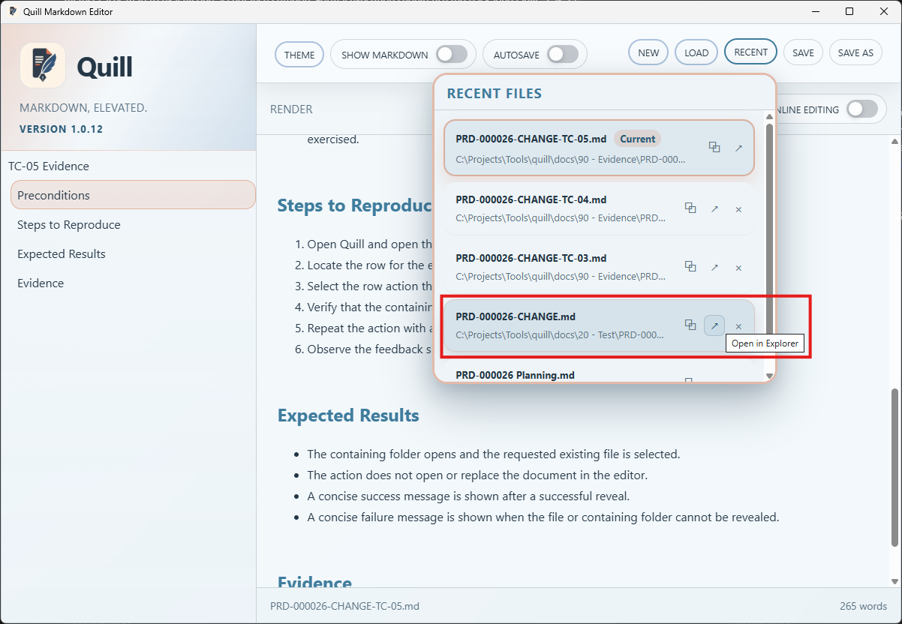
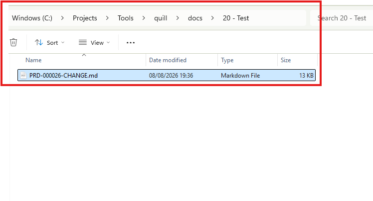
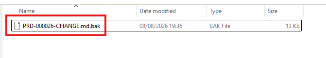
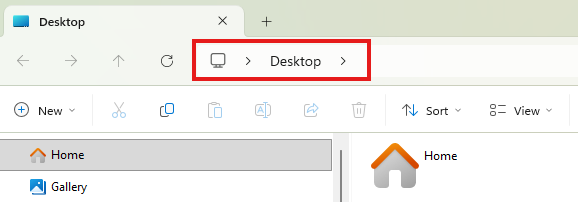

# TC-05 Evidence

| Field | Detail |
| --- | --- |
| PRD | [PRD-000026-CHANGE](../../docs/25%20-%20Closed/PRD-000026-CHANGE.md) |
| Acceptance Criteria | AC-05 |
| Product Version | 1.0.12 |
| Status | complete |
| Recorded | 2026-08-08T18:44:46.1608400Z |
| Test | Verify that the Recent Files action opens the containing folder and selects the requested file, with clear feedback when the operation succeeds or fails. |
| Result | PASS |

## Preconditions

- Run the packaged Quill `1.0.12` candidate on Windows.
- Have a recent-file entry for an existing file whose path can be resolved.

## Steps to Reproduce

1. Open Quill and open the Recent Files panel.
2. Locate the row for the existing file.
3. Select the row action that reveals the file in its containing folder.
4. Verify that the containing folder opens and the requested file is selected.
5. Observe the feedback shown for the successful request.
6. Temporarily rename the target file so the stored recent-file path no longer resolves.
7. Invoke the reveal action for the renamed-file entry and observe the folder opened by Explorer.

## Expected Results

- The containing folder opens and the requested existing file is selected.
- The action does not open or replace the document in the editor.
- A concise success message is shown after a successful reveal.
- Failure behavior is not covered by this evidence record.
- When the target file no longer exists after being temporarily renamed, the observed Explorer destination is the Desktop rather than the original containing folder.

## Evidence

The Recent Files panel shows the reveal action for `PRD-000026-CHANGE.md`.

Windows Explorer is open to `docs/20 - Test` with `PRD-000026-CHANGE.md` selected.

The original file is temporarily renamed to `PRD-000026-CHANGE.md.bak`.

After invoking the reveal action with the original path unavailable, Explorer is shown at the Desktop.
