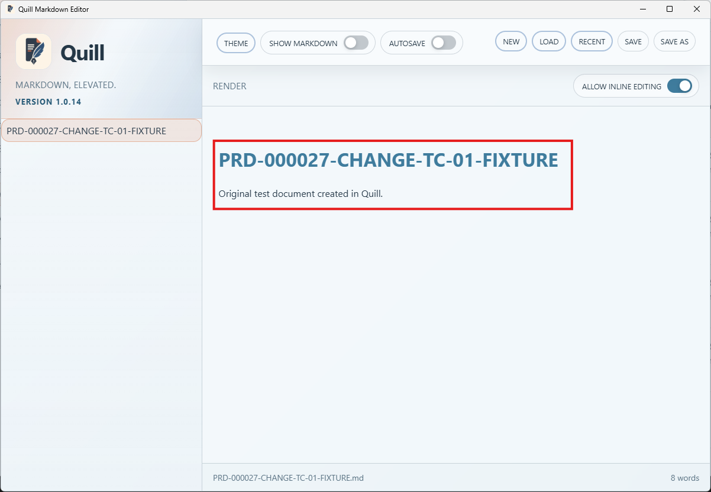
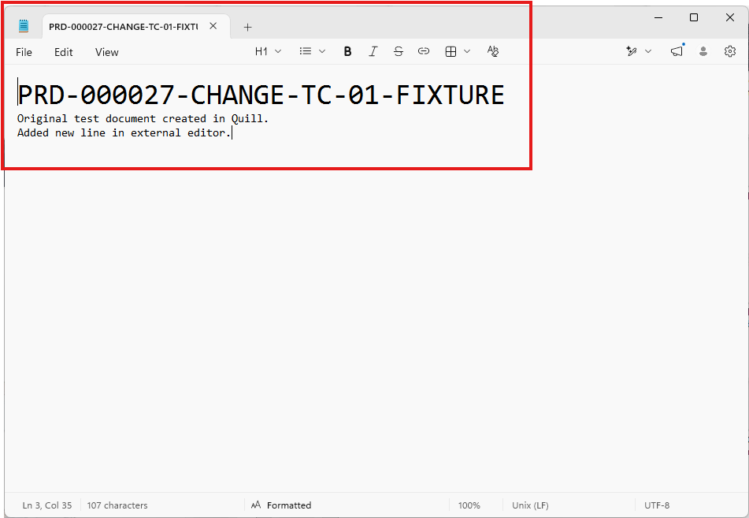
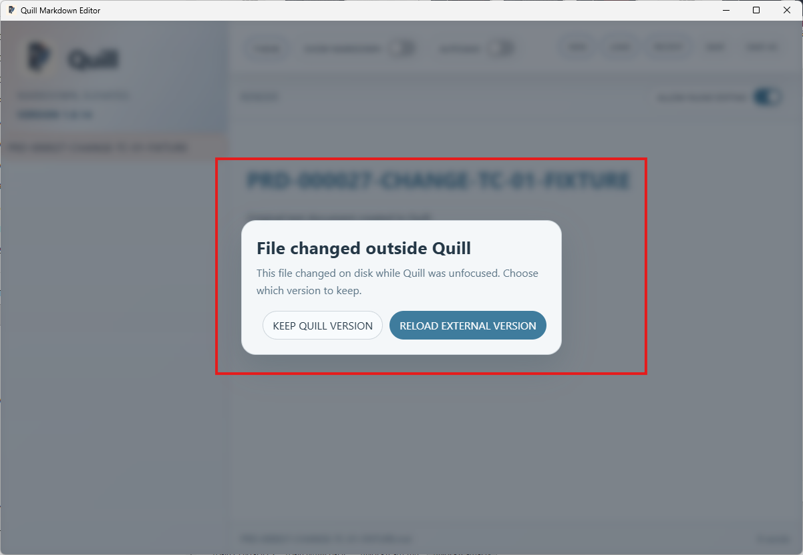
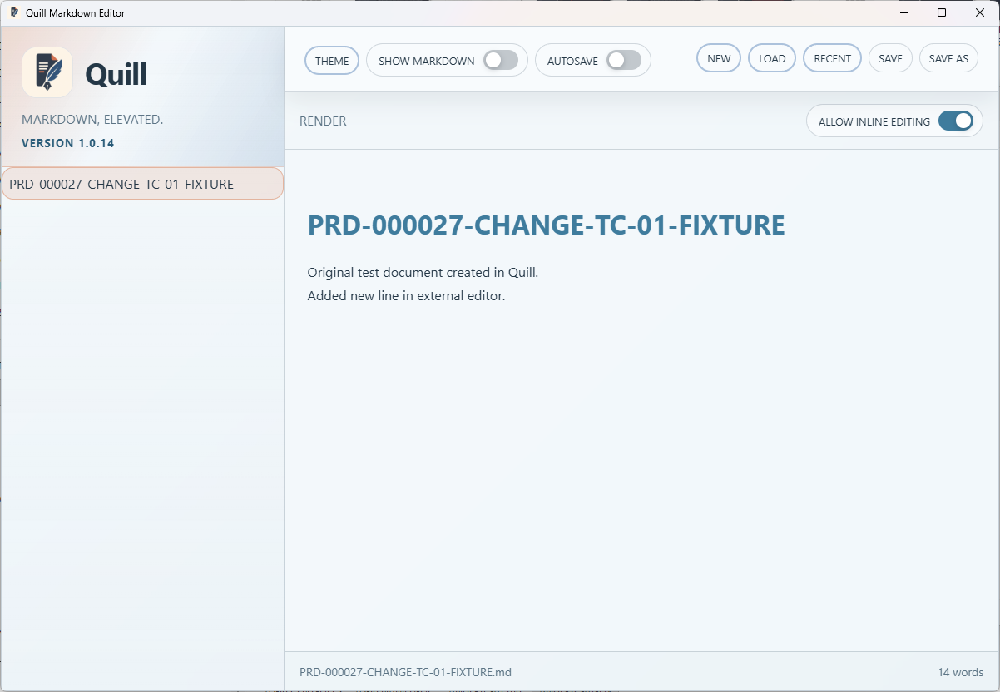

# TC-01 Evidence

| Field | Detail |
| --- | --- |
| PRD | [PRD-000027-CHANGE](../../docs/25%20-%20Closed/PRD-000027-CHANGE.md) |
| Acceptance Criteria | AC-01 |
| Product Version | 1.0.14 |
| Status | complete |
| Recorded | 2026-08-15T23:41:16.3937191Z |
| Test | Modify the open file externally while Quill is unfocused, regain focus, and verify that Quill detects the change before replacing or saving content. |
| Result | PASS |

## Preconditions

- Run the packaged Quill `1.0.14` candidate.
- Open a disposable Markdown file in Quill and confirm the file is unchanged before leaving Quill unfocused.
- Have a second editor or file-management tool available to modify the same file externally; Windows Notepad was used.

## Steps to Reproduce

1. Open the disposable Markdown file in Quill and confirm the original content is displayed.
2. Switch focus away from Quill and add a new line in Windows Notepad.
3. Save the externally modified file.
4. Return focus to Quill.
5. Confirm Quill displays the `File changed outside Quill` prompt before replacing content.
6. Select `RELOAD EXTERNAL VERSION`.
7. Confirm the externally added line appears in Quill.

## Expected Results

Quill detects the external modification when focus returns, displays an external-change prompt before replacing content, and loads the externally modified version only after the explicit reload choice.

## Evidence

Screenshots from the manual run:

