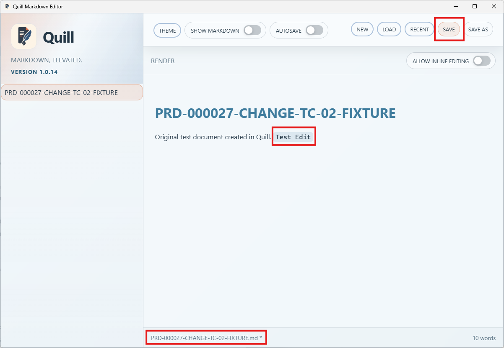
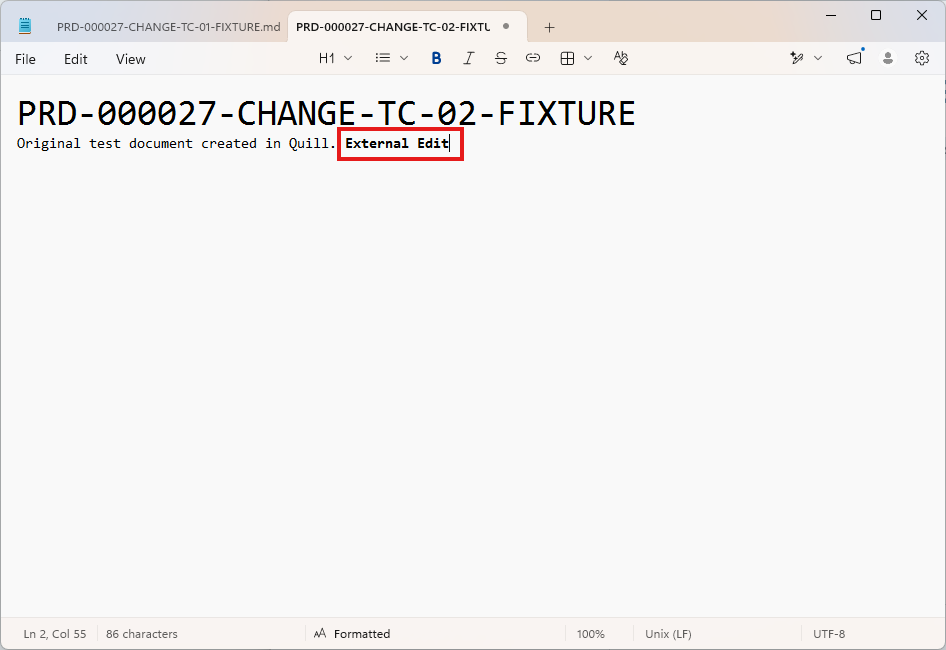
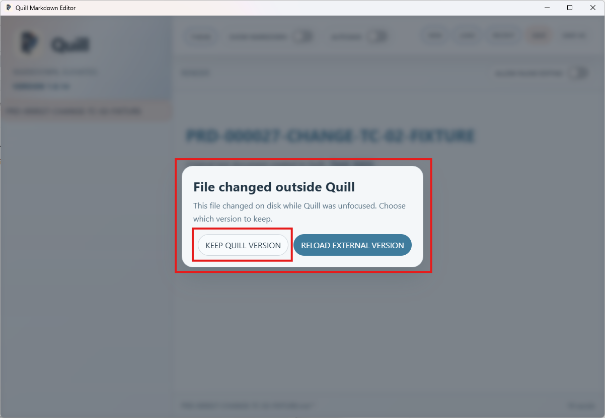
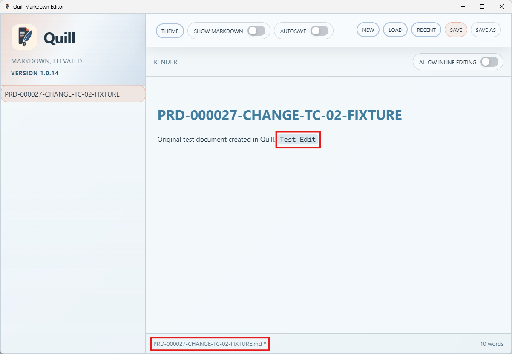

# TC-02 Evidence

| Field | Detail |
| --- | --- |
| PRD | [PRD-000027-CHANGE](../../docs/25%20-%20Closed/PRD-000027-CHANGE.md) |
| Acceptance Criteria | AC-02 |
| Product Version | 1.0.14 |
| Status | complete |
| Recorded | 2026-08-16T03:59:01.0123584Z |
| Test | Exercise the `KEEP QUILL VERSION` action and verify that it preserves the current Quill version. |
| Result | PASS |

## Preconditions

- Use the packaged Quill `1.0.14` candidate.
- Open a disposable Markdown file in Quill and prepare a second editor or file-management tool to modify the same file externally.
- Ensure the open file has a known baseline before creating an external change.
- Prepare distinct Quill and external contents so the selected version is unambiguous.

## Steps to Reproduce

1. Open the disposable `PRD-000027-CHANGE-TC-02-FIXTURE.md` document in Quill and make the identifiable `Test Edit` change.
2. Change the same file externally to the identifiable `External Edit` content while Quill is unfocused, then save the external change.
3. Return focus to Quill and confirm the external-change prompt appears while the current Quill content remains intact.
4. Select `KEEP QUILL VERSION`.
5. Verify that Quill retains the `Test Edit` content and that the dirty indicator remains present rather than silently reloading the external version.

## Expected Results

After `KEEP QUILL VERSION` is selected, Quill preserves the current in-memory `Test Edit` version without silently replacing it with the external version, and the dirty indicator remains present. No content is discarded before the explicit choice.

## Evidence

Screenshots from the manual run:

