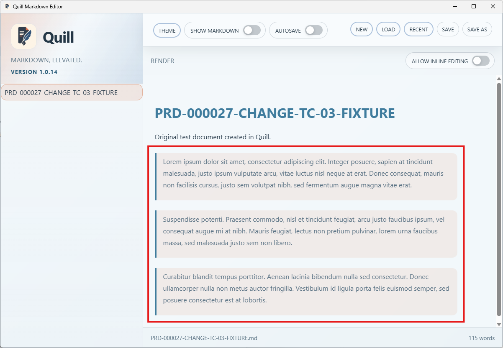
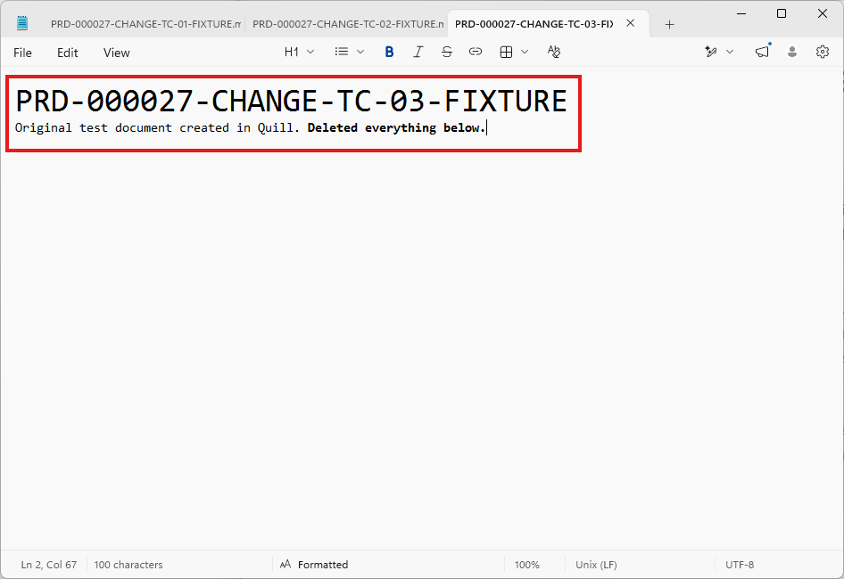
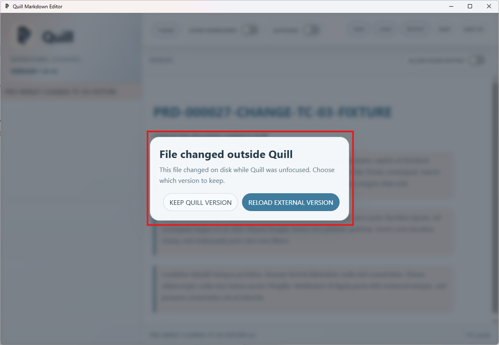

# TC-03 Evidence

| Field | Detail |
| --- | --- |
| PRD | [PRD-000027-CHANGE](../../docs/25%20-%20Closed/PRD-000027-CHANGE.md) |
| Acceptance Criteria | AC-03 |
| Product Version | 1.0.14 |
| Git Commit | 502d505bc8db8141f6cd1bd7267f48b0d80ad85a |
| Status | complete |
| Recorded | 2026-08-16T04:14:02.7560991Z |
| Test | PASS: Verify that the longer Quill document remains unchanged while an external-change prompt is pending. |
| Result | The external editor showed the file edited with the content below the first lines removed. Quill continued to display the longer document, including the three Lorem Ipsum paragraphs, beneath the external-change prompt; the Quill content remained unchanged while the prompt awaited a decision. |

## Preconditions

- Product candidate `1.0.14` was running.
- The longer [PRD-000027-CHANGE-TC-03-FIXTURE.md](PRD-000027-CHANGE-TC-03-FIXTURE.md) was open in Quill.
- The fixture contained the heading, original document text, and three Lorem Ipsum paragraphs.
- The file was modified externally while Quill was unfocused.

## Steps to Reproduce

1. Open `PRD-000027-CHANGE-TC-03-FIXTURE.md` in Quill and confirm that the longer document is visible.
2. Edit the same file in an external editor while Quill is unfocused, removing the content below the first lines.
3. Return focus to Quill and wait for the external-change prompt to appear.
4. Before selecting either prompt action, compare the Quill document with the content shown before the external edit.

## Expected Results

The external-change prompt appears, and Quill does not reload or discard its current document before the user chooses an action. The longer Quill content remains visible and unchanged while the prompt is pending.

## Evidence

- Initial longer fixture displayed in Quill:

  

- External editor after the file was edited:

  

- Quill conflict prompt with the longer document still visible underneath:

  
