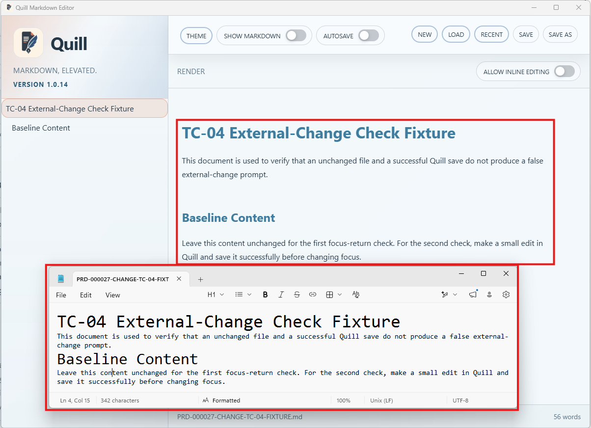
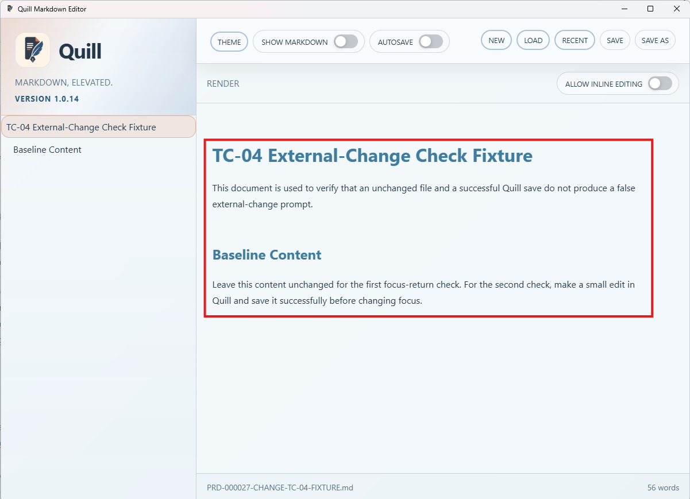
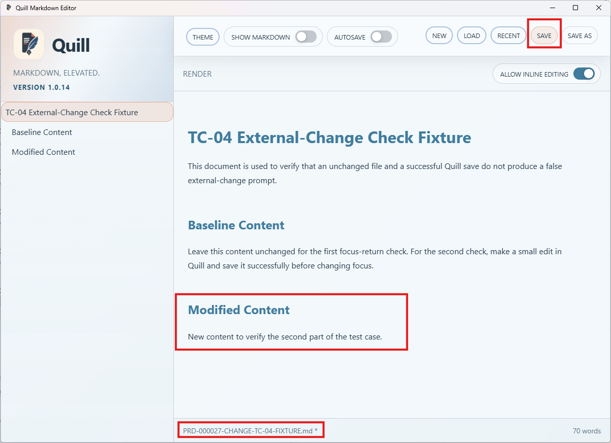
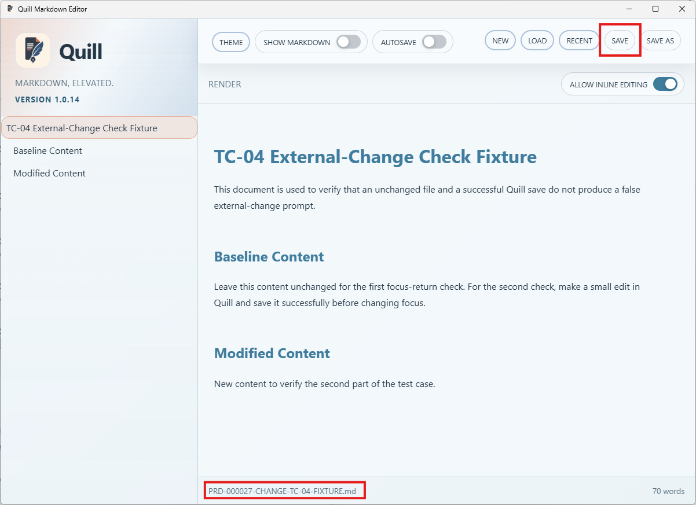
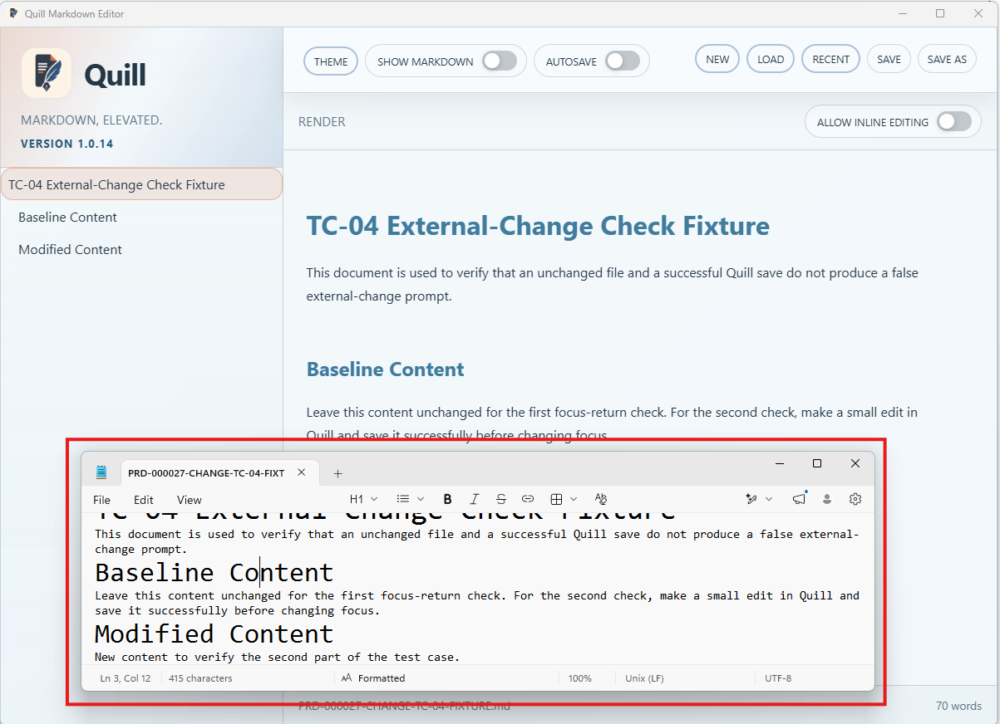
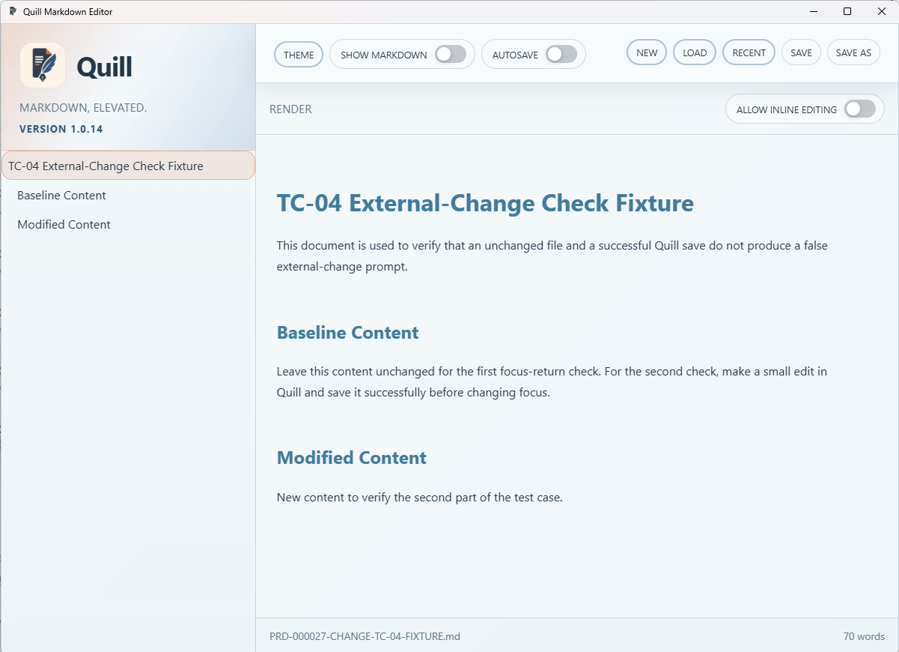

# TC-04 Evidence

| Field | Detail |
| --- | --- |
| PRD | [PRD-000027-CHANGE](../../docs/25%20-%20Closed/PRD-000027-CHANGE.md) |
| Acceptance Criteria | AC-04 |
| Product Version | 1.0.14 |
| Status | complete |
| Recorded | 2026-08-16T10:04:03.7562972Z |
| Test | PASS/FAIL: Verify that an unchanged file and a successful Quill-originated save do not produce an external-change prompt when Quill regains focus. |
| Result | PASS: Quill lost focus and regained focus without displaying an external-change prompt. Part 2 also shows content modified in Quill, saved successfully, and still present after focus returned with no message shown. |

## Preconditions

- Use the packaged Quill candidate for this PRD.
- Open a supported Markdown document in Quill and allow it to finish loading.
- Ensure the document is unchanged by any external program before each scenario.

## Steps to Reproduce

1. Open the document in Quill without changing it externally.
2. Move focus away from Quill, then return focus to Quill.
3. Observe whether an external-change prompt appears.
4. Modify the document in Quill and save it successfully.
5. Move focus away from Quill, then return focus to Quill.
6. Observe whether an external-change prompt appears after the Quill-originated save.

## Expected Results

- Regaining focus with an unchanged file does not display an external-change prompt.
- Regaining focus after a successful Quill save does not display a false external-change prompt.

## Evidence

The supplied screenshots show the Quill fixture open at product version 1.0.14 with no external-change message after focus was lost and regained:

### Part 2 — Quill-Originated Save

The additional screenshots show the fixture after content was modified in Quill, the `SAVE` action was used successfully, focus was lost and regained, and no external-change message appeared:

- [Part 2 screenshot 1](PRD-000027-CHANGE-TC-04-PART-2-01.png)
- [Part 2 screenshot 2](PRD-000027-CHANGE-TC-04-PART-2-02.png)
- [Part 2 screenshot 3](PRD-000027-CHANGE-TC-04-PART-2-03.png)
- [Part 2 screenshot 4](PRD-000027-CHANGE-TC-04-PART-2-04.png)

