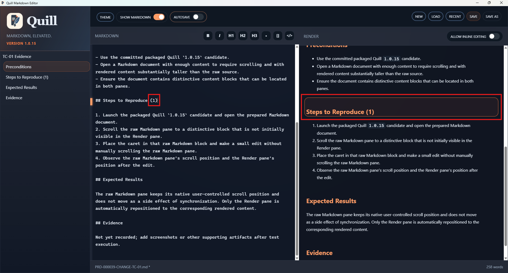

# TC-01 Evidence

| Field | Detail |
| --- | --- |
| PRD | [PRD-000039-CHANGE](../../docs/25%20-%20Closed/PRD-000039-CHANGE.md) |
| Acceptance Criteria | AC-01 |
| Product Version | 1.0.15 |
| Status | complete |
| Recorded | 2026-08-17T19:28:55.4079995Z |
| Test | PASS: Verify that editing raw Markdown preserves the raw Markdown pane's native scroll position while repositioning only the Render pane to the corresponding content. |
| Result | The supplied screenshot records the packaged Quill `1.0.15` candidate with the TC-01 evidence document open simultaneously in the Markdown and Render panes. |

## Preconditions

- Use the committed packaged Quill `1.0.15` candidate.
- Open a Markdown document with enough content to require scrolling and with rendered content substantially taller than the raw source.
- Ensure the document contains distinctive content blocks that can be located in both panes.

## Steps to Reproduce

1. Launch the packaged Quill `1.0.15` candidate and open the prepared Markdown document.
2. Scroll the raw Markdown pane to a distinctive block that is not initially visible in the Render pane.
3. Place the caret in that raw Markdown block and make a small edit without manually scrolling the raw Markdown pane.
4. Observe the raw Markdown pane's scroll position and the Render pane's position after the edit.

## Expected Results

The raw Markdown pane keeps its native user-controlled scroll position and does not move as a side effect of synchronization. Only the Render pane is automatically repositioned to the corresponding rendered content.

## Evidence

Supplied screenshot showing the TC-01 evidence document rendered in both panes, including the prepared preconditions, reproduction steps, and expected results.
