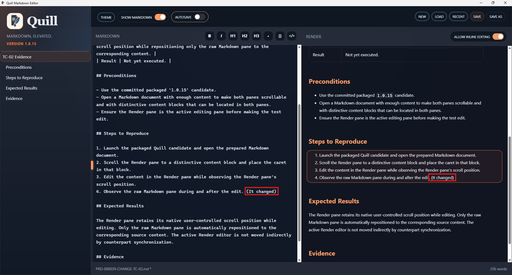

# TC-02 Evidence

| Field | Detail |
| --- | --- |
| PRD | [PRD-000039-CHANGE](../../docs/25%20-%20Closed/PRD-000039-CHANGE.md) |
| Acceptance Criteria | AC-02 |
| Product Version | 1.0.15 |
| Status | complete |
| Recorded | 2026-08-17T19:32:25.2173510Z |
| Test | PASS: Verify that editing the Render pane preserves its native scroll position while repositioning only the raw Markdown pane to the corresponding content. |
| Result | The supplied execution screenshot shows the Render-pane edit reflected in the raw Markdown pane as `(It changed)`. The active Render pane remains in its captured position while the corresponding raw Markdown content is visible. |

## Preconditions

- Use the committed packaged `1.0.15` candidate.
- Open a Markdown document with enough content to make both panes scrollable and with distinctive content blocks that can be located in both panes.
- Ensure the Render pane is the active editing pane before making the test edit.

## Steps to Reproduce

1. Launch the packaged Quill candidate and open the prepared Markdown document.
2. Scroll the Render pane to a distinctive content block and place the caret in that block.
3. Edit the content in the Render pane while observing the Render pane's scroll position.
4. Observe the raw Markdown pane during and after the edit.

## Expected Results

The Render pane retains its native user-controlled scroll position while editing. Only the raw Markdown pane is automatically repositioned to the corresponding source content. The active Render editor is not moved indirectly by counterpart synchronization.

## Evidence

The screenshot captures Quill version `1.0.15`, the edited Render content, and the corresponding `(It changed)` text in the raw Markdown pane.
