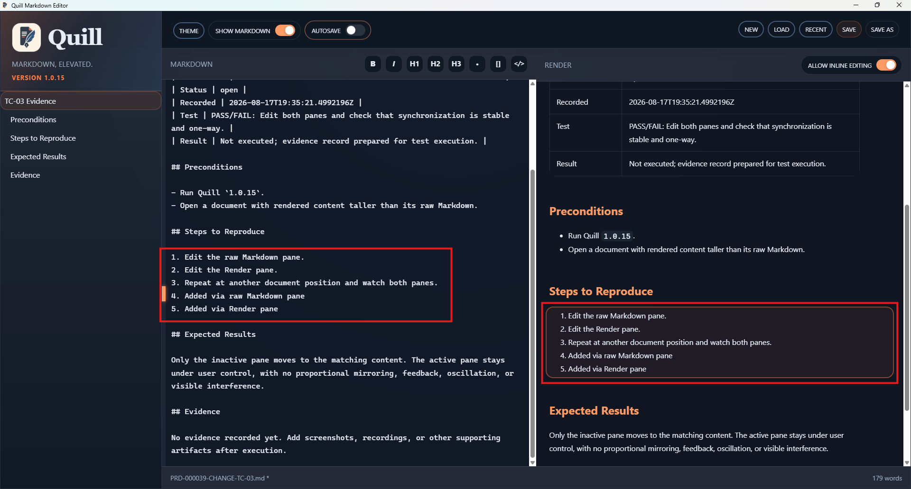

# TC-03 Evidence

| Field | Detail |
| --- | --- |
| PRD | [PRD-000039-CHANGE](../../docs/25%20-%20Closed/PRD-000039-CHANGE.md) |
| Acceptance Criteria | AC-03 |
| Product Version | 1.0.15 |
| Git Commit | 8eba8e4 |
| Status | complete |
| Recorded | 2026-08-17T19:49:23.5482227Z |
| Test | PASS: Edit both panes and check that synchronization is stable and one-way. |
| Result | The active pane remains under user control while the inactive pane follows the matching content without visible proportional mirroring, feedback, oscillation, or interference. |

## Preconditions

- Run Quill `1.0.15`.
- Open a document with rendered content taller than its raw Markdown.

## Steps to Reproduce

1. Edit the raw Markdown pane.
2. Edit the Render pane.
3. Repeat at another document position and watch both panes.

## Expected Results

Only the inactive pane moves to the matching content. The active pane stays under user control, with no proportional mirroring, feedback, oscillation, or visible interference.

## Evidence

The screenshot shows the simplified steps executed in both the raw Markdown and Render panes, with the corresponding content visible in each pane.
