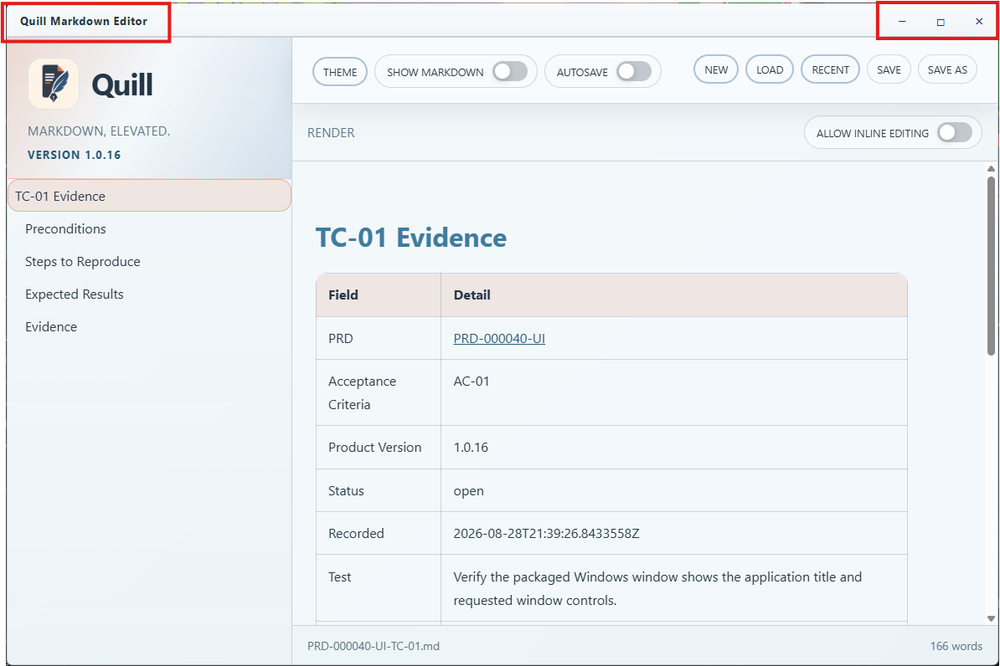

# TC-01 Evidence

| Field | Detail |
| --- | --- |
| PRD | [PRD-000040-UI](../../docs/25%20-%20Closed/PRD-000040-UI.md) |
| Acceptance Criteria | AC-01 |
| Product Version | 1.0.16 |
| Status | complete |
| Recorded | 2026-08-28T21:42:31.5978905Z |
| Test | Verify the packaged Windows window shows the application title and requested window controls. |
| Result | PASS |

## Preconditions

Use the committed Quill `1.0.16` Windows packaged candidate on a Windows desktop at the standard display scale. Ensure no other Quill instance is being used for the test.

## Steps to Reproduce

1. Launch the packaged Quill `1.0.16` application.
2. Inspect the HTML title bar at the top of the window.
3. Identify the displayed title and the available window-control buttons.

## Expected Results

The title bar displays `Quill Markdown Editor` and contains only minimize, maximize/restore, and close controls.

## Evidence

The supplied screenshot shows the packaged Quill `1.0.16` window with the `Quill Markdown Editor` title and the minimize, maximize/restore, and close controls visible in the custom title bar.

