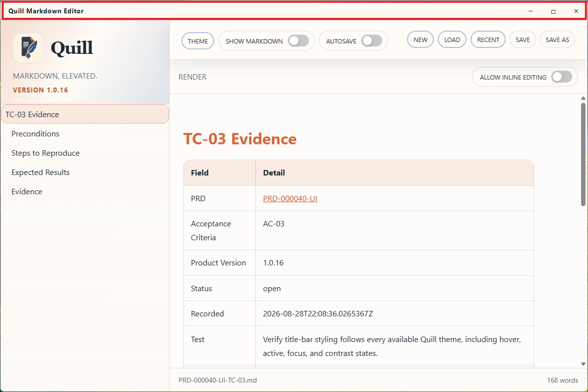
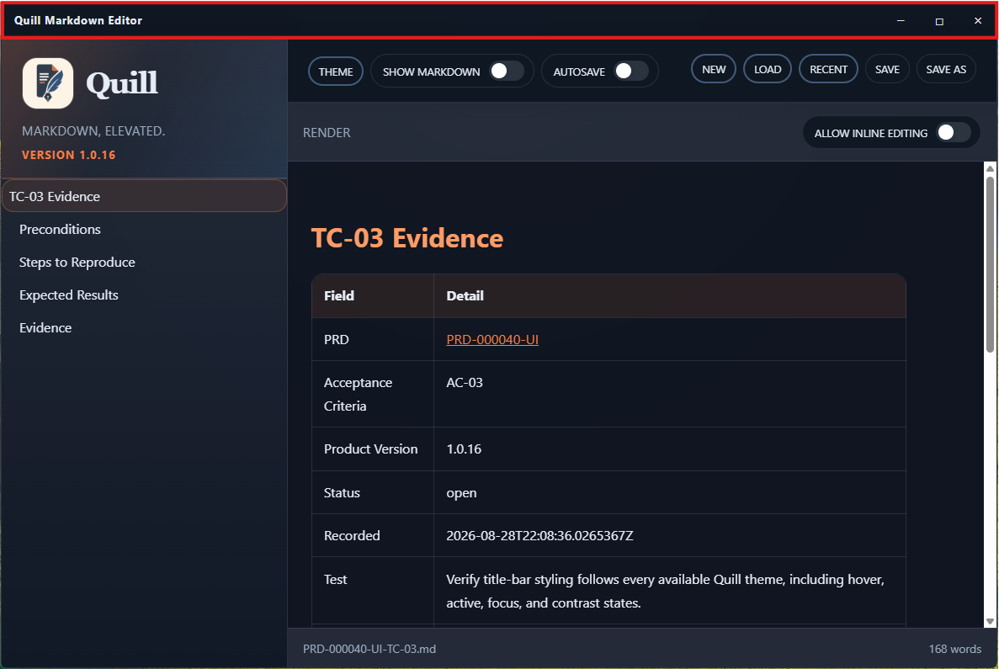
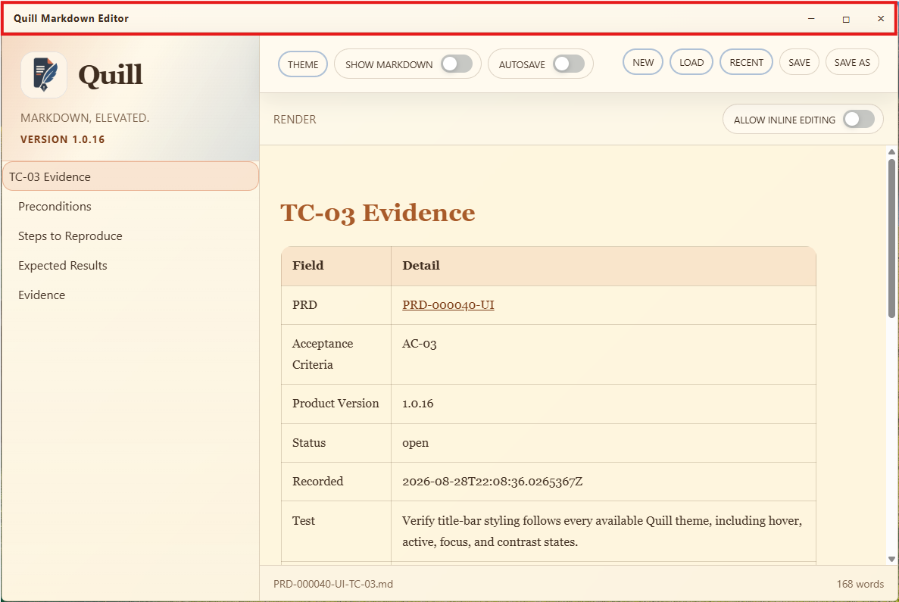
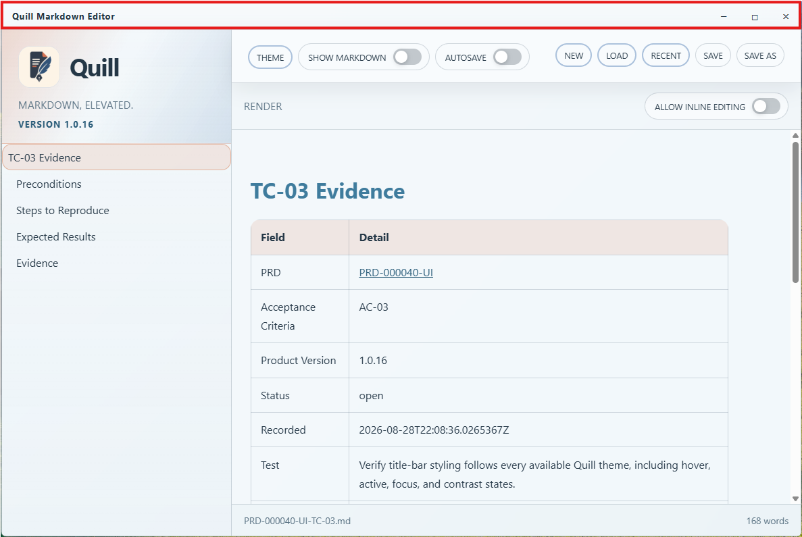

# TC-03 Evidence

| Field | Detail |
| --- | --- |
| PRD | [PRD-000040-UI](../../docs/25%20-%20Closed/PRD-000040-UI.md) |
| Acceptance Criteria | AC-03 |
| Product Version | 1.0.16 |
| Status | complete |
| Recorded | 2026-08-28T22:11:42.6275896Z |
| Test | Verify title-bar styling follows every available Quill theme, including hover, active, focus, and contrast states. |
| Result | PASS |

## Preconditions

Use the packaged Quill `1.0.16` Windows candidate at 100% scaling. Ensure the application can switch through every available Quill theme and that the title bar is visible.

## Steps to Reproduce

1. Launch the packaged Quill `1.0.16` Windows candidate.
2. Observe the title bar in the initially selected theme.
3. Switch through every available Quill theme.
4. For each theme, inspect the title bar's normal, hover, active, keyboard-focus, and text/icon contrast states.

## Expected Results

The title bar updates with the selected theme and remains readable and distinguishable across the recorded theme states.

## Evidence

The supplied screenshots record the title bar and surrounding Quill styling in each selected theme:

