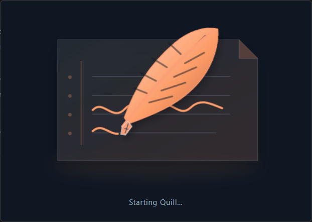
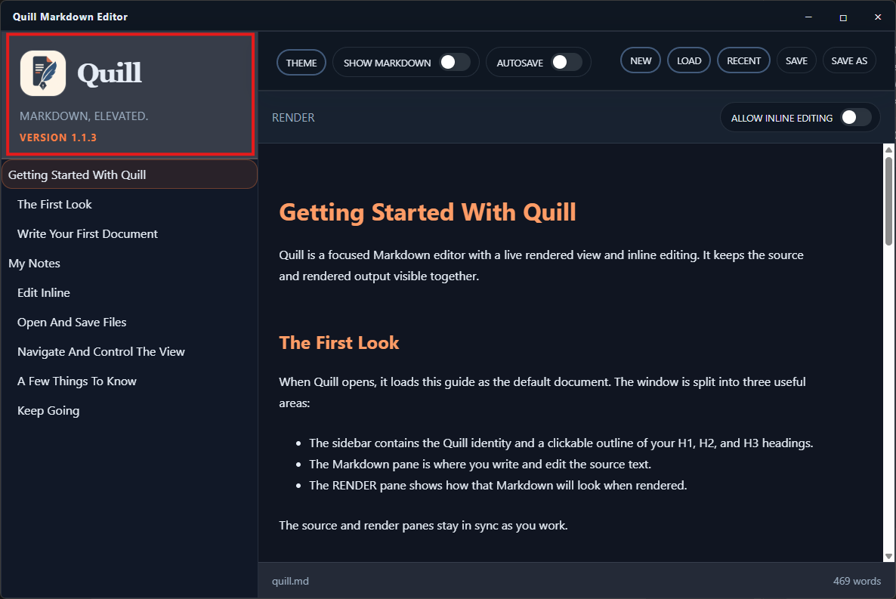

# TC-01 Evidence

| Field | Detail |
| --- | --- |
| PRD | [PRD-000047-UI](../../docs/25%20-%20Closed/PRD-000047-UI.md) |
| Acceptance Criteria | AC-01 |
| Product Version | 1.1.3 |
| Status | complete |
| Recorded | 2026-08-31T17:39:59.9873601Z |
| Test | Launch the packaged application and verify the initial splash presentation. |
| Result | PASS |

## Preconditions

- Use the committed packaged candidate identified by the PRD as version `1.1.3`.
- Start with no existing Quill windows open.
- Test on an active monitor with its usable display bounds available.

## Steps to Reproduce

1. Launch the packaged Quill application.
2. Observe the windows shown during startup.
3. Inspect the splash window's placement, animation, status text, and internal spacing.

## Expected Results

The main editor window remains hidden. A compact splash window is visible, centered within the active monitor's usable bounds, and displays the complete startup animation and status with balanced padding.

## Evidence

Splash presentation: 
Resulting editor window: 
The screenshots show the compact splash presentation and the Quill 1.1.3 editor state after startup.
